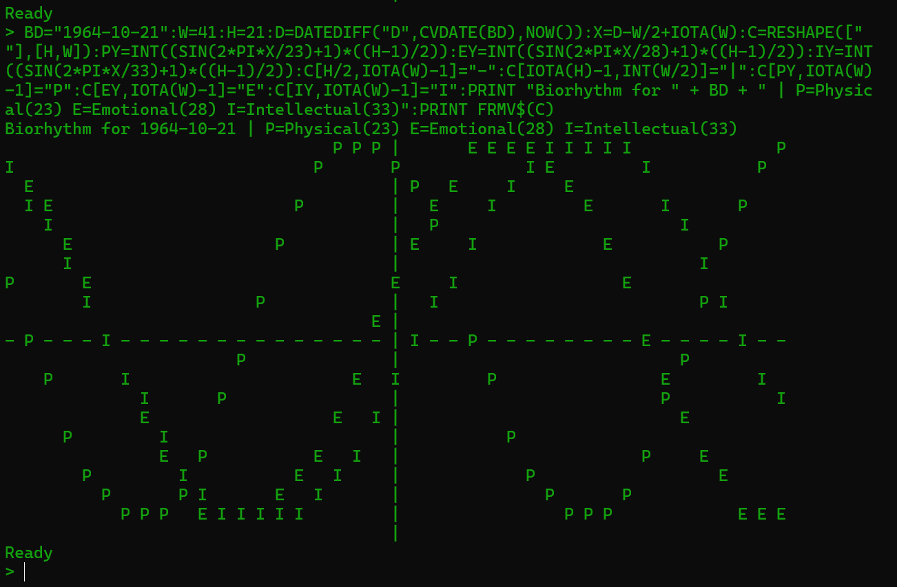

# jdBasic - A modern functional BASIC Interpreter

**jdBasic**: A modern BASIC interpreter with APL-style array processing and a built-in Tensor engine for building and training neural networks from scratch.

Whether you're looking to relive the nostalgia of 8-bit coding with modern conveniences or explore powerful data processing paradigms in a simple syntax, jdBasic offers a unique and powerful environment. The language is designed to be easy to learn but capable enough to build complex, modular applications.

## Key Features

jdBasic is packed with features that bridge the gap between retro and modern programming:

#### Classic BASIC Foundations

  * Familiar control flow with `FOR...NEXT` loops, `GOTO`, and labels.
  * Multi-line `IF...THEN...ELSE...ENDIF` blocks for conditional logic.
  * Robust error handling with `TRY...CATCH...FINALLY` blocks.

#### APL-Inspired Array Programming

  * **N-Dimensional Arrays**: First-class support for vectors, matrices, and higher-dimension arrays.
  * **Element-Wise Operations**: Perform arithmetic on entire arrays at once (e.g., `My_Array * 2 + 5`). Most built-in functions (`SIN`, `SQR`, `RIGHT$`, etc.) are vectorized and apply to every element automatically.
  * **Data Analysis & Reduction**: Instantly aggregate arrays with `SUM`, `PRODUCT`, `MIN`, `MAX`, and perform cumulative operations with `SCAN`.
  
  

#### Modern Enhancements

  * **Modular Programming**: Organize your code into reusable modules with `IMPORT`.
  * **Rich Data Types**: Full support for `Date`/`Time` objects, `Map`s, and user-defined `TYPE`s.
  * **Cross-Platform**: Run your code on both Windows and Linux.
  * **Library Integration**: Connect to external libraries for databases (`SQLite`) and machine learning (`TensorFlow`).

#### Functional Programming Core

  * **First-Class Functions**: Treat functions as values. Assign them to variables and pass them to other functions using the `@` handle.
  * **Higher-Order Functions**: Use powerful functions like `SELECT` (map) and `FILTER` that take other functions as arguments.
  * **Lambda Functions**: Define anonymous, inline functions for concise data manipulation (e.g., `lambda i -> i * 2`).
  * **Pipe Operator (`|>`):** Chain function calls together into elegant, readable data pipelines.

## Getting Started

Read the language reference:
[https://github.com/AtomiJD/jdBasic/blob/development/doc/languages.md](https://github.com/AtomiJD/jdBasic/blob/development/doc/languages.md)

Read the manual:
[https://github.com/AtomiJD/jdBasic/blob/development/doc/manual.md](https://github.com/AtomiJD/jdBasic/blob/development/doc/manual.md)

Get the latest release at: [https://github.com/AtomiJD/jdBasic/releases/tag/jdbasic](https://github.com/AtomiJD/jdBasic/releases/tag/jdbasic)
Download: release.zip
Extract it wherever you want.
Open a command window and change your directory to the "jdb" folder.

To run a jdBasic program, simply pass the source file to the interpreter from your command line:

```basic
..\bin\jdBasic test.jdb
```

If you want to code in vs code take a look at:
[https://github.com/AtomiJD/jdBasic/blob/development/vscode_extension/vscode_readme.md](https://github.com/AtomiJD/jdBasic/blob/development/vscode_extension/vscode_readme.md)

## Language Tour: A Look at the Syntax

### Functional Pipelines with Lambdas and Pipes

This is where jdBasic truly shines. You can combine higher-order functions (`SELECT`, `FILTER`), anonymous `lambda` functions, and the pipe operator (`|>`) to create powerful and declarative data processing pipelines.

```basic
' --- Functional Pipeline Example ---

' Start with a sequence of numbers from 1 to 10
numbers = IOTA(10)
PRINT "Original numbers: "; numbers

' This pipeline:
' 1. Filters the numbers to keep only those greater than 5
' 2. Multiplies each of the remaining numbers by 10
' The '?' in the pipe sequence is a placeholder for the result of the previous step.
result = numbers |> FILTER(lambda val -> val > 5, ?) |> SELECT(lambda v -> v * 10, ?)

PRINT "Result: "; result
' Expected Output: [60 70 80 90 100]
```


### Object-Oriented Programming with `TYPE`

Define your own data structures using `TYPE`, which can contain methods (`FUNC` or `SUB`). This allows for an object-oriented style of programming.

```basic
' --- RPG Player TYPE Example ---

TYPE Player
    Name AS STRING
    Health AS INTEGER
    MaxHealth AS INTEGER
    AttackPower AS INTEGER

    ' Method to take damage
    SUB TakeDamage(damage)
        ' 'THIS' refers to the current object instance
        THIS.Health = THIS.Health - damage
        IF THIS.Health < 0 THEN THIS.Health = 0
        PRINT THIS.Name; " takes "; damage; " damage! Health is now "; THIS.Health
    ENDSUB

    ' Method to check if the player is defeated
    FUNC IsDefeated()
        RETURN THIS.Health <= 0
    ENDFUNC

    ' Method to display status
    SUB ShowStatus()
        PRINT "--- Player: "; THIS.Name; " ---"
        PRINT "  Health: "; THIS.Health; " / "; THIS.MaxHealth
        PRINT "  Attack: "; THIS.AttackPower
    ENDSUB
ENDTYPE

' Create a player instance
DIM Hero AS Player
Hero.Name = "Arion"
Hero.Health = 100
Hero.MaxHealth = 100
Hero.AttackPower = 15

' Create an enemy
DIM Goblin AS Player
Goblin.Name = "Goblin"
Goblin.Health = 30
Goblin.MaxHealth = 30
Goblin.AttackPower = 5

Hero.ShowStatus()
Goblin.ShowStatus()

PRINT
PRINT "A wild Goblin appears! Battle starts!"
Goblin.TakeDamage(Hero.AttackPower) ' Hero attacks Goblin
IF NOT Goblin.IsDefeated() THEN
    Hero.TakeDamage(Goblin.AttackPower)  ' Goblin attacks Hero
ENDIF

IF Goblin.IsDefeated() THEN
    PRINT Goblin.Name; " has been defeated!"
ENDIF
```

## What's New & What's Next?

jdBasic is an active project with many recent additions and exciting plans.

#### What's New?

  * **Cross-Platform Support**: jdBasic is now available for both Windows and Linux\!
  * **Robust Error Handling**: The `TRY...CATCH...FINALLY` structure is fully implemented for writing safer, more resilient code.
  * **Advanced Array Operations**: Powerful APL functions like `SCAN` (cumulative reduce) and `ROTATE` (cyclical shift) have been added.
  * **Library Integrations**: jdBasic can now interface with external libraries, with modules for `SQLite` and `TensorFlow` already available.

#### What's Next?

  * **Enhanced Game Development**: Major improvements are planned for the `SPRITE` and `MAP` libraries to make game creation easier and more powerful.
  * **GUI Toolkit Integration**: We are exploring the integration of a GUI library to enable the creation of applications with native graphical user interfaces.
  * **Improved Linux Build**: The Linux version will be enhanced with libraries like SDL2 for better graphics and hardware support.

Contributions and feedback are welcome\!