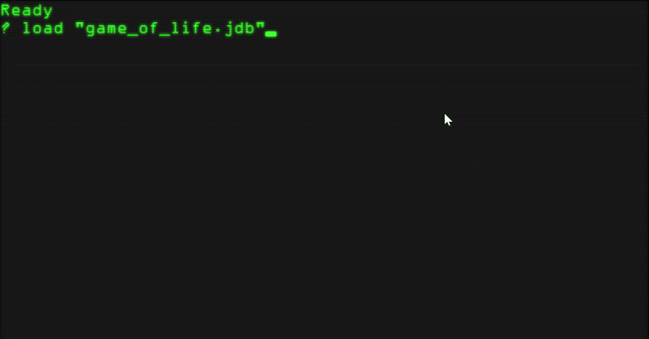

# jdBasic - The Neo Retro Lambda BASIC Interpreter

**jdBasic** (also known as **NeReLa BASIC** for **Ne**o **Re**tro **La**mbda) is not your grandfather's BASIC. It's a modern, powerful interpreter that blends the simplicity and familiarity of classic BASIC with concepts from functional and array-oriented programming.

Whether you're looking to relive the nostalgia of 8-bit coding with modern conveniences or explore powerful data processing paradigms in a simple syntax, jdBasic offers a unique and powerful environment. The language is designed to be easy to learn but capable enough to build complex, modular applications.

## Key Features

jdBasic is packed with features that bridge the gap between retro and modern programming:

#### Classic BASIC Foundations

* Familiar control flow with `FOR...NEXT` loops, `GOTO`, and labels.
* Multi-line `IF...THEN...ELSE...ENDIF` blocks for conditional logic.
* Single-line `IF...THEN` for concise checks.
* A rich library of built-in functions for string manipulation (`TRIM$`, `LEFT$`, `MID$`, `INSTR`, etc.) and math (`SQR`, `SIN`, `RND`, etc.).

#### APL-Inspired Array Programming

This is where jdBasic becomes a powerful tool for data manipulation, inspired by the APL programming language.

* **N-Dimensional Arrays**: First-class support for vectors, matrices, and higher-dimension arrays.
* **Element-Wise Operations**: Perform arithmetic on entire arrays at once (e.g., `My_Array = My_Array * 2 + 5`).
* **Array Creation**: Generate data with `IOTA` and change array dimensions with `RESHAPE`.
* **Slicing and Transformation**: Use `TAKE` and `DROP` to select elements, and `REVERSE` or `TRANSPOSE` to alter array structure.
* **Data Analysis & Reduction**: Instantly aggregate arrays with `SUM`, `PRODUCT`, `MIN`, `MAX`, `ANY`, and `ALL`. Use the powerful `GRADE` function to get sort indices for complex data analysis.
* **Advanced Linear Algebra**: Perform standard matrix multiplication with `MATMUL` and create combination tables with `OUTER`.

 

#### Modern Enhancements

* **Modular Programming**: Organize your code into reusable modules with `IMPORT`.
* **Typed Variables**: Declare variables with types like `DATE` for better code clarity and safety.
* **Rich Data Types**: In addition to arrays, jdBasic has full support for Date/Time objects.
* **Array Literals**: Initialize arrays with a simple, clean syntax (e.g., `my_array = [[1, 2], [3, 4]]`).

#### Functional Programming Core (The "Lambda" in NeReLa)

* **First-Class Functions**: Treat functions as values. Assign them to variables and pass them to other functions.
* **Higher-Order Functions**: Create functions that take other functions as arguments, enabling powerful patterns like `map` and `filter`.
* **Recursion**: Write elegant, recursive functions for tasks like calculating factorials or traversing data structures.
* **Clean Function/Procedure Syntax**: Easily define multi-line functions (`FUNC...ENDFUNC`) and procedures (`SUB...ENDSUB`).

## Getting Started

To run a jdBasic program, simply pass the source file to the interpreter from your command line:

```sh
# Replace 'jdBasic' with the actual executable name on your system
jdBasic test.bas
```

## Language Tour: A Look at the Syntax

The following examples demonstrate the core capabilities of the language.

### Looping and Control Flow

Classic `FOR...NEXT` loops and `GOTO` statements are fully supported for simple iteration and control.

```basic
' Classic For...Next loop
for i = 1 to 5
    print "lall: "; i
next i
```

### APL-Style Array Processing

This example demonstrates the power of array-oriented programming to calculate vector statistics with minimal looping.

```basic
' --- Vector Statistics using an APL-inspired style ---

PRINT "--- Array-Oriented Statistics ---"

' 1. Create a sample data vector using our array functions.
V = (IOTA(10) * 1.3) + 5

PRINT "Data Vector V: "; V

' 2. Calculate stats using reduction functions.
V_LEN = LEN(V)[0]
V_SUM = SUM(V)
V_MEAN = V_SUM / V_LEN

PRINT "Count: "; V_LEN
PRINT "Sum:   "; V_SUM
PRINT "Mean:  "; V_MEAN

' 3. Calculate Standard Deviation by operating on whole arrays.
DEVIATIONS = V - V_MEAN
SQUARED_DEVS = DEVIATIONS * DEVIATIONS
VARIANCE = SUM(SQUARED_DEVS) / V_LEN
STD_DEV = SQR(VARIANCE)

PRINT "Standard Deviation: "; STD_DEV
```

### Working with Arrays (Classic Syntax)

Declare, access, and initialize arrays with a modern literal syntax.

```basic
PRINT "Array Test"

' Declare an array of 20 elements
Dim a[20]

' Initialize arrays directly with literal values
my_numbers = [10, 20, 30, 40, 50]
my_strings$ = ["alpha", "beta", "gamma"]
```

### Date and Time

jdBasic has built-in support for date/time manipulation.

```basic
PRINT "--- DATE Test ---"
Print "Now: "; Now()

DIM deadline AS DATE
deadline = CVDate("2025-07-01") ' Convert string to Date type
deadline = DATEADD("D", 10, deadline) ' Add 10 days

If deadline > Now() then
    print "Deadline is in the future"
endif
```

### Functional Programming: The Heart of jdBasic

This is where jdBasic truly shines. Functions are first-class citizens.

#### Higher-Order Functions

The `@` operator creates a reference to a function, allowing it to be passed as an argument.

```basic
' A function that takes another function as an argument
func apply(fa, cc)
    return fa(cc) ' Execute the passed-in function
endfunc

' A simple function to be used as an argument
func inc(ab)
    return ab+1
endfunc

' Pass the 'inc' function to 'apply'
print apply(inc@, 10)  ' Prints 11
```

## Future Roadmap

jdBasic is an active project. Future plans include:

* **Advanced APL Features**: Implementing `SCAN` (cumulative reduce), `ROTATE`.
* **Expanded Standard Library**: Creating more modules for features like enhanced file I/O or gaming stuff.
* **Improved Error Reporting**: Providing more descriptive messages and context for runtime errors.
* **Cross-platform Builds**.

Contributions and feedback are welcome!