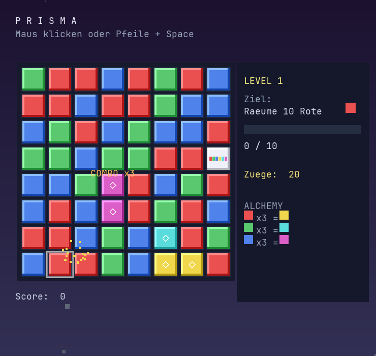
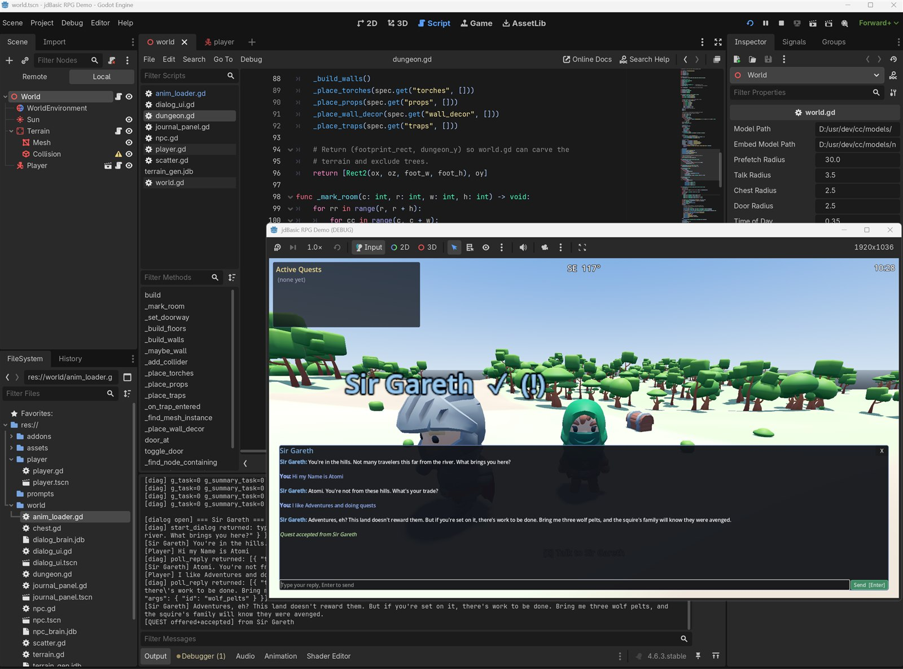
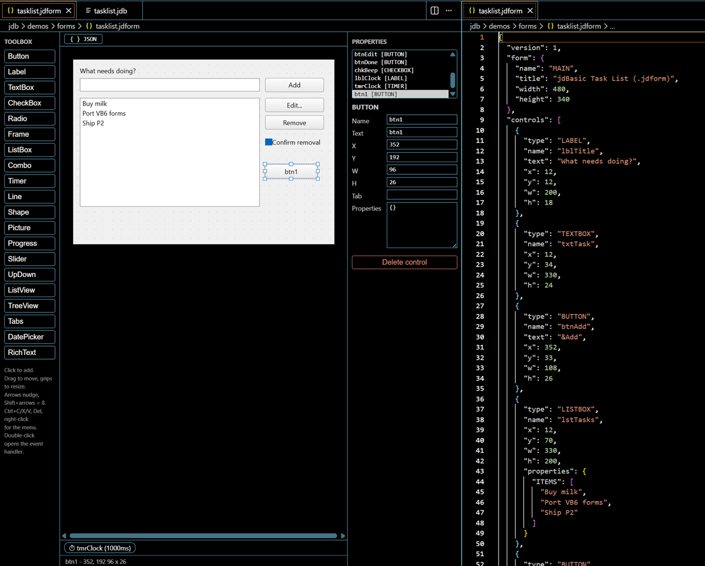
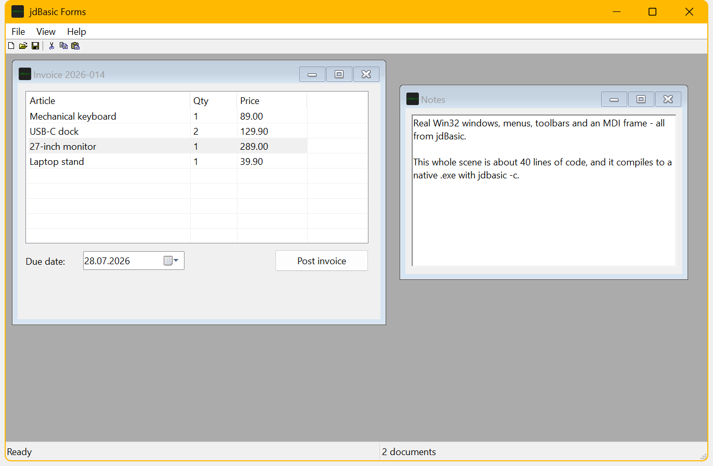
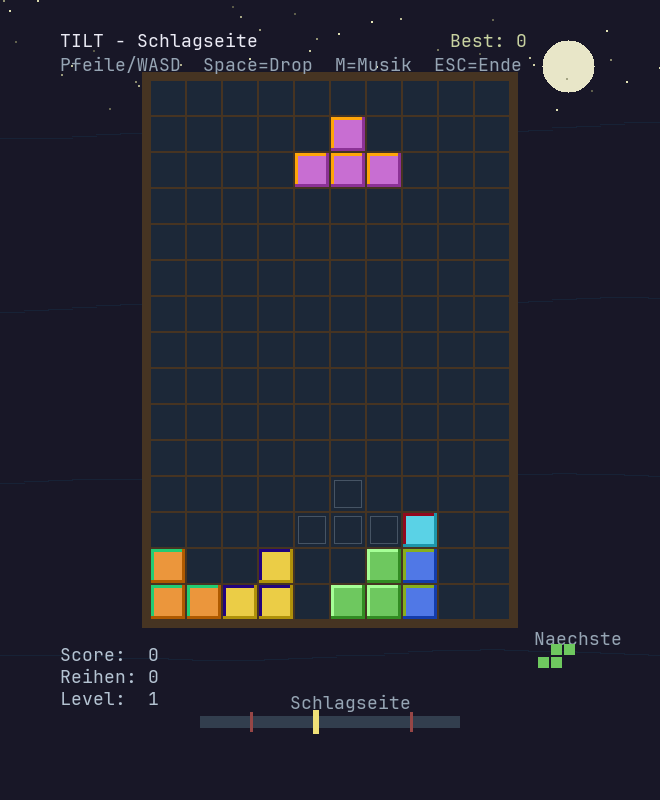
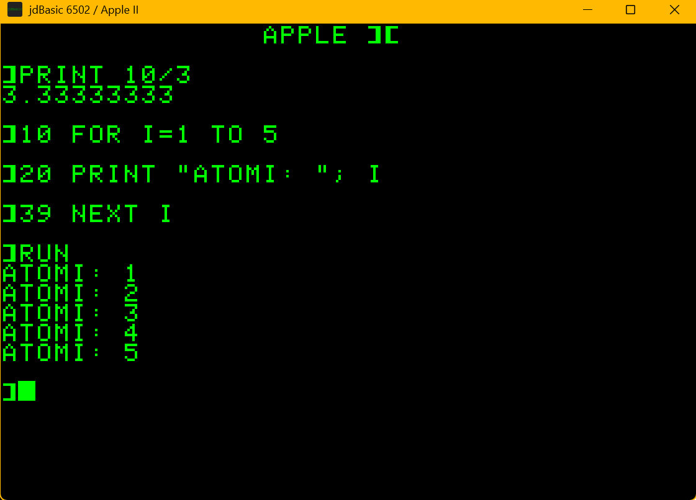
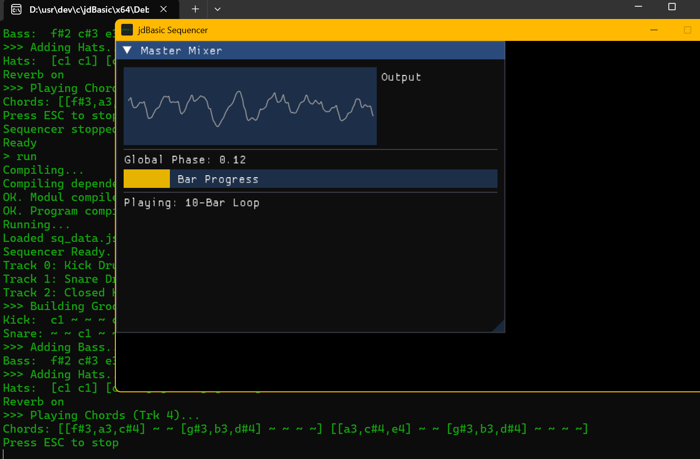

# jdBasic - A Persistent Experimental BASIC Environment

[](https://github.com/AtomiJD/jdBasic/actions/workflows/ci.yml)
[](LICENSE.txt)
[](https://github.com/AtomiJD/jdBasic/releases/latest)
[](https://jdbasic.org/live/index.html)
[](https://www.youtube.com/playlist?list=PLowaSH4O3MGq-veO7qSIp-9EntEjY_iPZ)

**jdBasic** is a modern BASIC interpreter built around a custom **bytecode virtual machine** with APL-style array programming, hot-reloadable code, a persistent REPL workspace, and first-class graphics, GUI, audio, networking, AI, and **Godot-engine** integration.

It combines the immediacy of classic BASIC with powerful built-in capabilities and a "stay in the session" philosophy - no constant restarts, no rebuild loops, just **think and run**.

> **Reduce friction between thinking and running code.**

<p align="center">
  
  
  
</p>
<p align="center"><em>A match-3 game, a Godot RPG whose NPCs think with a local LLM, and the VS Code form designer - all scripted in jdBasic.</em></p>

> **🎥 Train jdBasic** is on YouTube - 14 video lessons covering everything from PRINT to native compilation, all auto-generated and voiced by jdBasic itself. **[Watch the playlist →](https://www.youtube.com/playlist?list=PLowaSH4O3MGq-veO7qSIp-9EntEjY_iPZ)**

You can:

- explore ideas in a powerful interactive REPL
- save and restore entire sessions with `SAVEWS` / `LOADWS`
- write vectorized data pipelines using APL-inspired array operators
- prototype graphics, games, and tools with SDL3 + Dear ImGui
- embed in **Godot 4** and script whole 3D games, tools, and visualizers in pure BASIC
- talk to local LLMs (llama.cpp) and run ONNX models inline
- pair-program with an AI agent: the built-in **MCP server** exposes a persistent VM that Claude Code, Cursor & Co. can run, inspect, and live-patch without restarting your program
- build automation tools, REST clients, and serial-device controllers
- extend the language with native modules

---

## Try jdBasic in your browser

[jdbasic.org/live](https://jdbasic.org/live/index.html) - no installation required.

---

## Watch the lessons

The **Train jdBasic** YouTube series walks through the language from
"Hello, World" to native compilation - 14 episodes, 5–10 minutes each,
with auto-generated chapters and code-on-screen as it happens.

▶️ **[Full playlist on YouTube](https://www.youtube.com/playlist?list=PLowaSH4O3MGq-veO7qSIp-9EntEjY_iPZ)**

| #  | Lesson | Topic |
|----|--------|-------|
| 01 | [Hello jdBasic](https://youtu.be/4qvPFoqxPHE) | PRINT, DIM, basic types |
| 02 | [If and For](https://youtu.be/RTI-f9cHldI) | IF/ELSE, FOR/NEXT, FizzBuzz |
| 03 | [Arrays](https://youtu.be/V33CGCt1zB8) | Vector ops, broadcasting, reductions |
| 04 | [Strings](https://youtu.be/NUhdrMU9T9c) | Slice, search, SPLIT |
| 05 | [Functions and SUBs](https://youtu.be/_4Q7qR1sA3Q) | FUNC, SUB, recursion |
| 06 | [Maps](https://youtu.be/vp0tCYa6__A) | Key-value data |
| 07 | [INPUT and DO Loops](https://youtu.be/1Sd7jCzY8Zc) | User-driven programs |
| 08 | [File I/O](https://youtu.be/gbFvgqIYNMM) | TXTWRITER, TXTREADER$ |
| 09 | [Graphics](https://youtu.be/qtBCNaVaRLA) | SCREEN, shapes, colours |
| 10 | [Modules](https://youtu.be/fg0ib3SgGio) | EXPORT, IMPORT, code reuse |
| 11 | [REPL Workflow](https://youtu.be/Noa4mqwEZ5w) | PRETTY, LINT, SAVEWS |
| 12 | [Higher-Order Functions](https://youtu.be/WPpzO0tHJNE) | SELECT, FILTER, REDUCE, lambdas |
| 13 | [HTTP and JSON](https://youtu.be/ecq8uZHAV7U) | Talk to the web |
| 14 | [Native Compilation](https://youtu.be/4DlthnUo56w) | Compile to .exe with `jdbasic -c` |

The entire production pipeline - voice synthesis, screen recording,
FFmpeg compositing, even the YouTube uploads - is itself a jdBasic
program. See [`jdb/tv/`](jdb/tv/) if you want to fork the rig.

---

## What's inside (v2)

This is the **v2 rewrite**. Compared to the original tree-walking interpreter, jdBasic now ships with:

- A **bytecode compiler + virtual machine** with inline caches, opcode fusion, and a fast intrusive‑refcount value type
- **APL-style vectorization** - `SIN`, `COS`, `+`, `*`, scatter/gather, `IOTA`, `REDUCE`, `SCAN`, `FILTER`, `SELECT` all operate over arrays in a single op
- **Eigen-backed linear algebra & DSP** - `SVD`, `QR`, `DET`, `EIG`, and `FFT`/`IFFT` as first-class array builtins
- **SDL3** graphics with letterboxed logical presentation, `TOGGLE_FULLSCREEN`, and a streaming-texture batch plotter (`GFX.PLOT_POINTS_TEX`) that can push 70k coloured pixels per frame at 30+ FPS from pure BASIC
- **Dear ImGui** integration for instant-mode tools and debuggers
- **Godot 4 embed (GDExtension)** - run jdBasic *inside* Godot: `.jdb` files become engine scripts and the `GDX.*` suite reaches the whole engine (nodes, physics, 3D meshes, audio, signals), with an in-editor debugger and Inspector-exposed variables - see [`embed/godot/`](embed/godot/)
- **Music sequencer** - a tracker-style `SOUND.*` engine (patterns, voices, effects) with a device-less `SOUND_DSP` pull mode for embedding - see [`doc/SequencerHelp.md`](doc/SequencerHelp.md)
- **llama.cpp** for local LLM inference (CPU + optional CUDA)
- **ONNX Runtime** for classical ML inference
- **HTTP/HTTPS** client (OpenSSL), **COM** automation (Windows), **Serial** I/O for embedded
- **Reactive variables** (`->` operator) with automatic dependency propagation
- **Hot reload** of source files without losing the workspace
- **DAP debug adapter** so you can step through BASIC code from VS Code
- A **persistent REPL workspace** that survives restarts via `SAVEWS`/`LOADWS`
- An **MCP server** (`jdbasic --mcp`) that exposes the persistent VM to LLM agents like Claude Code, Cursor, or Cline - see [`doc/MCP.md`](doc/MCP.md)

> The original v1 codebase is preserved on the [`legacy-v1`](https://github.com/AtomiJD/jdBasic/tree/legacy-v1) branch and the [`v1-legacy`](https://github.com/AtomiJD/jdBasic/tree/v1-legacy) tag for archival and bugfixes.

---

## Language tour

### 1. Reactive variables

```basic
DIM BaseValue AS INTEGER = 10
DIM Multiplier AS INTEGER = 5

DIM Result AS REACT INTEGER
Result -> BaseValue * Multiplier

PRINT Result    ' 50

Multiplier = 10
PRINT Result    ' 100  - updated automatically
```

### 2. Vectorized array math (APL-style)

```basic
' Generate 10 numbers, keep > 5, multiply by 10
result = IOTA(10) |> FILTER(LAMBDA x -> x > 5, ?) |> SELECT(LAMBDA v -> v * 10, ?)
PRINT result    ' [60 70 80 90 100]
```

```basic
' All trig is vectorized - one call processes the whole array
DIM angles = IOTA(360) * (PI / 180)
DIM sines  = SIN(angles)
DIM cosines = COS(angles)
```

### 3. Immediate-mode GUI

```basic
SCREEN 800, 600, "My Tool"
DIM BgColor[4] = [0.2, 0.3, 0.3, 1.0]

DO
    CLS
    IF GUI.BEGIN("Control Panel", 50, 50, 300, 200) THEN
        GUI.TEXT "Welcome to jdBasic GUI"
        GUI.SEPARATOR()
        IF GUI.BUTTON("Click Me") THEN
            PRINT "Clicked at " + TIME$
        ENDIF
        GUI.COLOR("Background", BgColor)
    ENDIF
    GUI.END()
    SCREENFLIP
    SLEEP 16
LOOP UNTIL INKEY$() = "q"
```

### 4. Native Windows forms (VB6 style)

On Windows, the `FORMS` build flag adds a full retained-mode toolbox of **real Win32 controls**: buttons, text boxes, list/tree/list-view, tabs, sliders, date pickers, menus with accelerators, toolbars, status bars, MDI child windows and the classic common dialogs. Events bind by name convention, a one-parameter `SUB <control>_<event>` is wired automatically, no registration needed:

```basic
frm = FORM.CREATE("Hello", 320, 200, "MAIN")
btn = FORM.BUTTON(frm, "btnGo", "&Go", 110, 80, 100, 28)

SUB BTNGO_CLICK(e)
    MSGBOX("It really is that simple.", 64, "Hello")
ENDSUB

FORM.RUN(frm)
```

Layouts can live in declarative **`.jdform`** JSON files (`FORM.LOAD` instantiates and binds them), and the VS Code extension ships a **visual form designer** with drag/resize, property grid and double-click-to-handler. Coordinates are DPI-independent logical units, and the same source compiles to a standalone `.exe` with `jdbasic -c`. See `jdb/demos/forms/gallery.jdb` (every control on three tab pages) and `jdb/demos/forms/mdi_demo.jdb`.

<p align="center">
  
</p>

### 5. High-performance graphics

The [`jdb/demos/graphics/universe.jdb`](jdb/demos/graphics/universe.jdb) demo plots **70 000 coloured pixels per frame at 30+ FPS** from pure BASIC, by combining vectorized inner loops with a single GPU upload via `GFX.PLOT_POINTS_TEX`.

```bash
./build/jdBasic.exe jdb/demos/graphics/universe.jdb
```

### 6. APL-style pipelines

Vectorized arithmetic + bitops let you push real workloads - physics, cellular automata, SAT, DSP - through whole-array operations instead of per-cell loops. See **[doc/APL_pipeline.md](doc/APL_pipeline.md)** for a tutorial walking from "tight FOR loops" to "one line per update step" using the demos under `jdb/bench/` and `jdb/`. Highlights:

- `jdb/demos/apl/life_demo.jdb` - live Conway 200 × 150 at 60 FPS via an ONNX 3×3-conv backend
- `jdb/demos/graphics/boids_apl.jdb` - 5 000 particles at ~630 FPS, all-vector update
- `jdb/demos/sound/synth_apl.jdb` - additive synthesis, 4 096 samples/frame in five vector ops
- `jdb/bench/life_bench.jdb` / `jdb/bench/mandelbrot_bench.jdb` - when APL form wins (Conway, 4–13×) and when it loses (Mandelbrot, ~4×)

Numbers from the latest run: **[jdb/bench/Results.md](jdb/bench/Results.md)**.

---

## jdBasic in Godot

jdBasic embeds in **Godot 4** as a GDExtension: a `.jdb` file *is* a Godot script. The `GDX.*` native suite reaches the engine directly - nodes, the physics server, 3D meshes and materials, audio buses, and signals - so you can build whole scenes without a line of GDScript and step through them in the in-editor debugger.

```basic
EXTENDS Node3D            ' this .jdb file IS the Godot script

DIM cube_h = 0

SUB _ready()
    cube_h = GDX.CALL(GDX.SELF(), "get_node", "Cube")
ENDSUB

SUB _process(delta)
    ' spin the cube; rotation:y indexes into the Vector3 property
    GDX.SET(cube_h, "rotation:y", GDX.GET(cube_h, "rotation:y") + delta)
ENDSUB
```

Four projects under [`godot/`](godot/) show how far it goes - all logic in jdBasic, running on Windows and Linux (NVIDIA/CUDA and AMD/Vulkan):

- **`rpg-native`** - a 3D action-RPG: procedural heightmap terrain, a data-driven dungeon, day/night, an item shop, and **NPCs whose entire dialogue brain is a local LLM** (llama.cpp) with RAG over the world lore - quests, memory, and tool-calling, all in jdBasic.
- **`audioviz`** - a live **microphone → FFT → 3D spectrum waterfall**, built on the new `FFT` builtin with an orbiting camera.
- **`livecoder`** - the `SOUND.*` sequencer hosted in Godot with a mixer UI and TR-808 samples, for live-coding music.
- **`jd-one`** - a sandbox of small scenes (Breakout, a spinning cube, a reactive audio tunnel, GDScript-vs-jdBasic benchmarks).

See [`embed/godot/README.md`](embed/godot/README.md) for the embed architecture and the `GDX.*` reference.

> **Status: experimental.** The embed is developed on the `godot_spinoff` branch and there are no prebuilt extension binaries yet - you build the GDExtension yourself (SCons recipe included). The projects above run, but expect sharp edges.

---

## Sample gallery

The [`jdb/` sample gallery](jdb/README.md) holds 250+ ready-to-run programs, organised by domain: complete games (a chess engine, a raytracer, Tetris, TILT, PRISMA), a **6502 CPU + Apple II emulator**, a music sequencer with FX racks, web apps with sessions and templates, TUI dashboards, AI/RAG demos, and the APL teaching set.

<p align="center">
  
  
  
</p>
<p align="center"><em>TILT - an Apple II emulated in 30 KB of jdBasic - the live music sequencer with its ImGui scope.</em></p>

---

## Getting started

### Run it
- **Online**: [jdbasic.org/live](https://jdbasic.org/live/index.html)
- **Windows binaries**: see [Releases](https://github.com/AtomiJD/jdBasic/releases) - what changed is in [RELEASE_NOTES.md](RELEASE_NOTES.md)

> **First run on Windows.** The binaries are code-signed, but because the
> certificate is new, Microsoft Defender SmartScreen may show a *"Windows
> protected your PC - unrecognised app"* prompt the first time you run
> `jdBasic.exe`. It is a reputation notice, **not** a malware detection - the
> signed publisher is shown in the dialog. Click "More info" then "Run anyway".
> To skip it, right-click the downloaded `.zip` -> Properties -> tick
> **Unblock** before extracting.

### Your first 60 seconds

Download a bundle from [Releases](https://github.com/AtomiJD/jdBasic/releases/latest) (the **VB6 pack** is a good all-round choice - it ships demos), unzip, then:

```
jdBasic.exe                     starts the REPL
```

```basic
? PRINT "Hello, jdBasic!"
Hello, jdBasic!
? PRINT SUM(IOTA(100))          ' array programming: 1+2+...+100
5050
? HELP "SORT"                   ' built-in reference for every command
```

Run a program from a file:

```
jdBasic.exe demos\gallery.jdb   native Win32 forms, every control
jdBasic.exe demos\tasklist.jdb  a small app built with the visual designer
```

Cloned the repo and built from source instead? Try the pixel-storm:

```bash
./build/jdBasic.exe jdb/demos/graphics/universe.jdb
```

### Build it from source
- See **[doc/BUILD.md](doc/BUILD.md)** for the full build guide (prerequisites, third-party libraries, feature flags, packaging)

### Learn the language
- **Video tutorials**: [Train jdBasic playlist on YouTube](https://www.youtube.com/playlist?list=PLowaSH4O3MGq-veO7qSIp-9EntEjY_iPZ) - 14 episodes, beginner to native compile
- **Examples**: the [sample gallery](jdb/README.md) - 250+ programs under [`jdb/`](jdb/)

### Documentation

| Doc | What it covers |
|-----|----------------|
| [doc/languages.md](doc/languages.md) | The full language reference - every statement, function and build-flag-gated API |
| [help.txt](help.txt) | Per-command reference, also served by `HELP "topic"` in the REPL |
| [doc/BUILD.md](doc/BUILD.md) | Building from source: prerequisites, feature flags, packaging (Windows/Linux/macOS) |
| [doc/MCP.md](doc/MCP.md) | The MCP server: client configs for Claude Code, Cursor, Cline & Co., tool reference |
| [doc/WebDev.md](doc/WebDev.md) | Web apps with `HTTP.SERVER`, templates, sessions and SQLite - the JDWEB framework |
| [doc/SequencerHelp.md](doc/SequencerHelp.md) | The `SOUND.*` live-coding sequencer and synth |
| [doc/AudioFX.md](doc/AudioFX.md) / [doc/HowTo-FX.md](doc/HowTo-FX.md) | The FX chain: guitar/synth effects, FFT analysis, the ImGui pedalboard |
| [doc/APL_pipeline.md](doc/APL_pipeline.md) | Tutorial: from tight FOR loops to whole-array update steps |
| [doc/howto-vector-matrix-data.md](doc/howto-vector-matrix-data.md) | Data-wrangling cookbook: build, transform, group, reshape |
| [doc/idioms-from-python.md](doc/idioms-from-python.md) | Python-to-jdBasic cheat sheet (also great context for AI agents) |
| [doc/CODING_STYLE.md](doc/CODING_STYLE.md) | Conventions for contributing to the C++ core |

### Tooling
- **VS Code extension**: syntax highlighting and DAP debugger support - see [vscode_extension/vscode_readme.md](vscode_extension/vscode_readme.md)

---

## Project layout

```
src/        - interpreter source (lexer, parser, compiler, VM, runtime modules)
bridges/    - optional native bridges (SQLite, Python, ...)
embed/      - Godot GDExtension (jdb_godot) that embeds the VM in Godot 4
embedded/   - the microcontroller ports: RP2350/PicoCalc, ESP32-S3, bare metal
godot/      - Godot projects: rpg-native (LLM RPG), audioviz, livecoder, jd-one
jdb/        - example .jdb programs - start at the sample gallery, jdb/README.md
fluppi/     - "Vallys Reise", a complete top-down RPG written in jdBasic
doc/        - documentation (see the table above) and doc/img/ screenshots
tests/      - regression suite; tests/gate/ holds the pre-commit gate suites
modules/    - modules that IMPORT finds by name from the working directory
resources/  - icon, manifest, version info, the bundled TTF fonts
tools/      - auxiliary scripts
wasm/       - the browser build behind jdbasic.org/live
vscode_extension/ - VS Code extension (.vsix) and install instructions
libs/       - third-party libraries (not in git, see doc/BUILD.md)
build/      - compile output (not in git)
```

---

## Contributing

Contributions, bug reports, and feedback are welcome - **[CONTRIBUTING.md](CONTRIBUTING.md)** has the full guide (build, commit conventions, code style). The core rule: the regression gate stays green. Four gate suites cover the language, the native compiler, and the APL pipeline:

```bash
./build/jdBasic.exe tests/gate/comprehensive_test.jdb
./build/jdBasic.exe tests/gate/native_test.jdb
./build/jdBasic.exe tests/gate/test_apl_complete.jdb
./build/jdBasic.exe tests/gate/test_apl_pipelines.jdb
```

All four should report `0 failed`. For changes that touch the LLVM codegen, run each suite again through the compiler (`./build/jdBasic.exe -c tests/gate/<suite>.jdb`, then run the produced `.exe`) so both the interpreter and native paths stay green. The full test-bank layout, naming conventions and the GUI smoke procedure are described in [tests/README.md](tests/README.md). C++ conventions live in [doc/CODING_STYLE.md](doc/CODING_STYLE.md).

---

## License

**MIT** - see [LICENSE.txt](LICENSE.txt). Third-party components are listed in [THIRD_PARTY_LICENSES.txt](THIRD_PARTY_LICENSES.txt).
