# jdBasic

**A BASIC you can change while it runs - by hand, or by asking an AI.**

[](https://github.com/AtomiJD/jdBasic/actions/workflows/ci.yml)
[](LICENSE.txt)
[](https://github.com/AtomiJD/jdBasic/releases/latest)
[](https://jdbasic.org/live/index.html)
[](https://www.youtube.com/playlist?list=PLowaSH4O3MGq-veO7qSIp-9EntEjY_iPZ)

[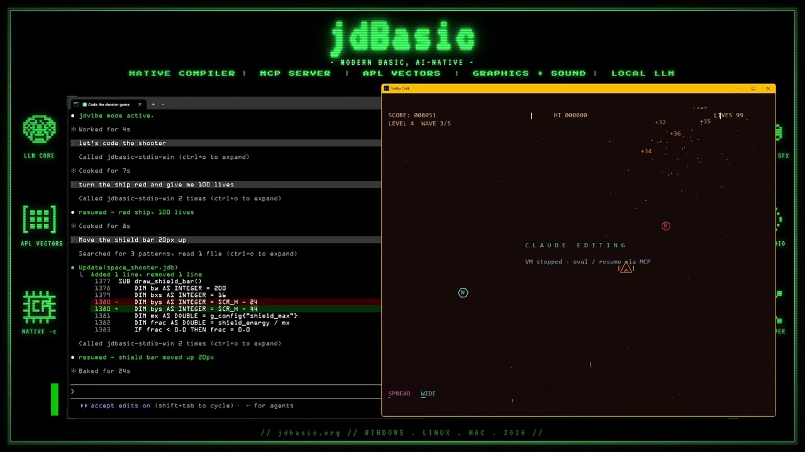](https://youtu.be/s-BRaSy1EQo)

<p align="center"><em>Claude Code pauses a running game, rewrites one SUB and resumes it - same score, same enemies, new code. <a href="https://youtu.be/s-BRaSy1EQo">Watch the 73-second video</a>.</em></p>

jdBasic is a BASIC that stays in the session. A bytecode VM with APL-style
arrays; graphics, GUI, sound, web and local AI built in; a compiler to native
`.exe`; and an MCP server that lets an AI agent inspect and patch your program
without restarting it.

**[Try it in the browser](https://jdbasic.org/live/index.html)** · **[Download](https://github.com/AtomiJD/jdBasic/releases/latest)** · **[Take the 15-minute tour](doc/tour.md)**

## Four things you have not seen a BASIC do

### 1. An AI edits the program while it runs

Press F6 in the running game and the VM pauses. Ask Claude "turn the ship red
and give me 100 lives" and it changes two variables through `jdb_eval`. Ask it
to "move the shield bar 20 pixels up" and it edits the source, `jdb_recompile`
swaps the changed SUB into the paused program and puts the program pointer
back where it was. Resume: nothing restarted, only the drawing changed. It
works with Claude Code, Cursor, Cline, Zed and anything else that speaks MCP.

[MCP setup and tool reference](doc/MCP.md) · [The story behind it](https://www.atomijd.onl/blog-post-19.html)

### 2. Whole arrays, no loops

```basic
N = 1000000
X = RND(IOTA(N)) * 2 - 1
Y = RND(IOTA(N)) * 2 - 1
PRINT 4 * SUM(X*X + Y*Y <= 1) / N     ' 3.14..., a million darts, half a second
```

<p align="center">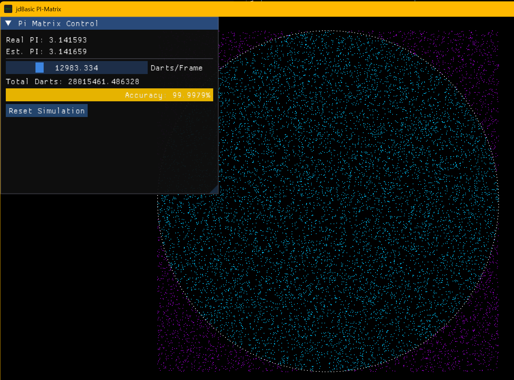</p>

Operators and functions take whole arrays, the way APL does: `IOTA`, `SCAN`,
`OUTER`, `GRADE`, matrices, `SVD`, `FFT`. [From loops to array pipelines](doc/APL_pipeline.md)

### 3. Real Windows apps, compiled to a native `.exe`

```basic
DIM frm = FORM.CREATE("Hello", 320, 200, "MAIN")
DIM btn = FORM.BUTTON(frm, "btnGo", "&Go", 110, 80, 100, 28)

SUB BTNGO_CLICK(e)
    MSGBOX("It really is that simple.", 64, "Hello")
ENDSUB

FORM.RUN(frm)
```

`jdbasic -c hello.jdb` turns it into `hello.exe`. Events bind by name, the
VS Code extension has a visual form designer, and the controls are real Win32
ones - menus, toolbars, list views, tabs, MDI windows. The VB6 way, in 2026.

<p align="center">
  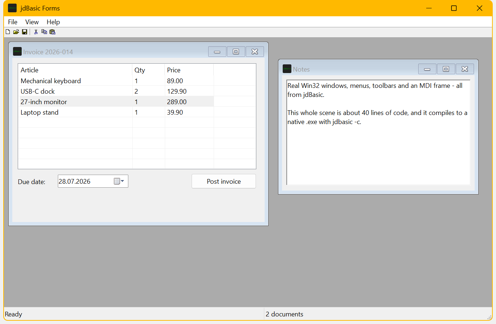
  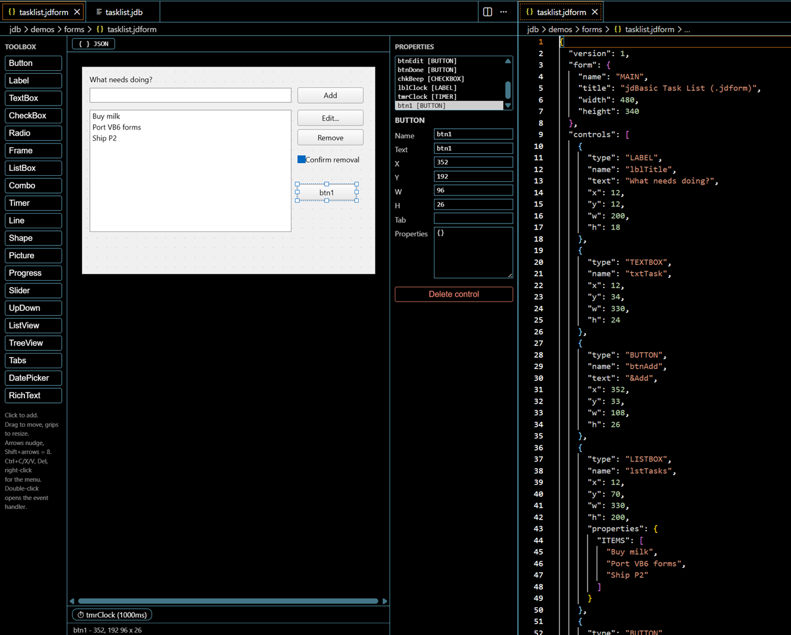
</p>

### 4. It compiles an operating system

<p align="center">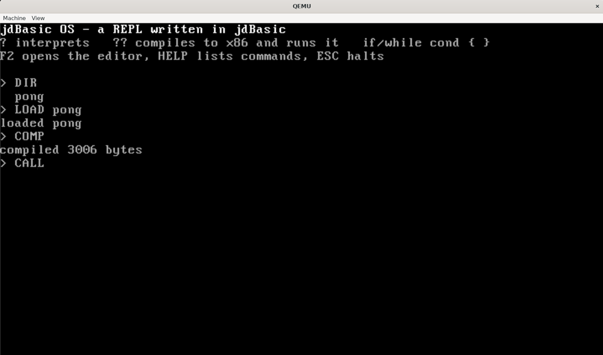</p>

jdBasic OS is written in jdBasic and boots on bare x86-64 with nothing
underneath - no libc, no C runtime, no host OS. Screen driver, keyboard, editor,
RAM disk, an interpreter and a JIT that emits x86-64 are all jdBasic source,
compiled with `--target=kernel`. At its prompt you type a small C-like language
of its own: `?` interprets a line, `??` compiles it to machine code and runs it,
and `COMP` turns a whole program - Pong above - into 3006 bytes of x86.
[Bare metal](embedded/kernel/README.md)

The jdBasic interpreter itself runs on microcontrollers: an RP2350 (PicoCalc)
and an ESP32-S3 that boots into its own jdBasic prompt on a touch display.
[On a board](embedded/)

## Start in 60 seconds

- **In the browser:** [jdbasic.org/live](https://jdbasic.org/live/index.html), nothing to install.
- **On Windows:** download a bundle from [Releases](https://github.com/AtomiJD/jdBasic/releases/latest), unzip, run `jdBasic.exe`. The **VB6 pack** is a good all-round choice and ships demos; **mcp-native** is the one for AI pair coding.
- **On Linux and macOS:** build from source, see [doc/BUILD.md](doc/BUILD.md).

```basic
? PRINT "Hello, jdBasic!"
Hello, jdBasic!
? PRINT SUM(IOTA(100))
5050
? HELP "SORT"
```

> **First run on Windows:** the binaries are code-signed, but the certificate is
> new, so SmartScreen may say *"Windows protected your PC"*. That is a
> reputation notice, not a malware finding - click "More info", then "Run
> anyway", or tick **Unblock** in the `.zip`'s properties before extracting.

Then take the **[tour](doc/tour.md)**: fifteen minutes from the first `PRINT` to a compiled `.exe`.

## I want to ...

| ... | Start here |
|---|---|
| learn the language | [The tour](doc/tour.md), then the [video lessons](https://www.youtube.com/playlist?list=PLowaSH4O3MGq-veO7qSIp-9EntEjY_iPZ) |
| look something up | [Language reference](doc/languages.md) - contents at the top, A-Z index at the end - or `HELP "name"` in the REPL |
| program together with an AI agent | [MCP server](doc/MCP.md) |
| write games and graphics | [Sample gallery](jdb/README.md), [graphics functions](doc/languages.md#graphics-and-multimedia-functions) |
| build desktop tools | [ImGui](doc/languages.md#imgui-functions) or [native Windows forms](doc/languages.md#native-windows-forms-form) |
| crunch arrays and data | [Array pipelines](doc/APL_pipeline.md), [vector and matrix cookbook](doc/howto-vector-matrix-data.md) |
| build a web app or an API | [Web development](doc/WebDev.md) |
| make music or process audio | [Sequencer](doc/SequencerHelp.md), [Audio FX](doc/AudioFX.md), [FX how-to](doc/HowTo-FX.md) |
| run local LLMs and ML models | [AI and machine learning](doc/languages.md#ai--machine-learning) |
| script Godot 4 | [The Godot embed](embed/godot/README.md) |
| run it on a microcontroller | [On a board](doc/languages.md#on-a-board-rp2350-and-esp32-s3), [ESP32 bring-up](embedded/esp32/README.md) |
| reuse ready-made modules | [Module library](lib/README.md) - 45 modules, from TESTKIT to XLSX |
| come from Python | [Idioms from Python](doc/idioms-from-python.md) |
| build jdBasic or contribute | [Building from source](doc/BUILD.md), [CONTRIBUTING.md](CONTRIBUTING.md) |

All documentation, grouped: [doc/README.md](doc/README.md).

## Gallery

<p align="center">
  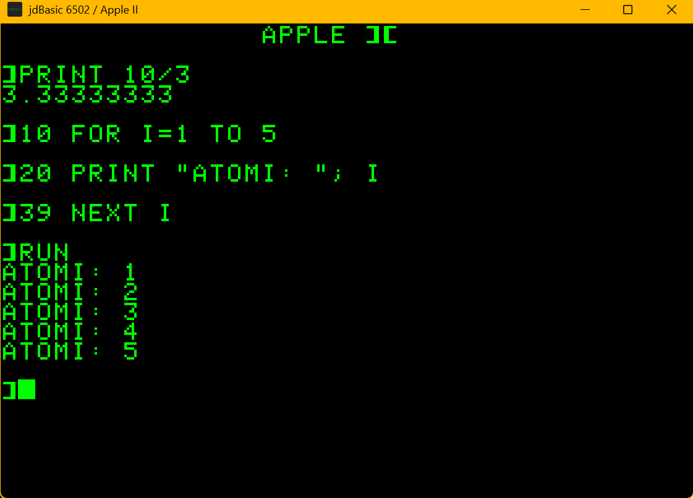
  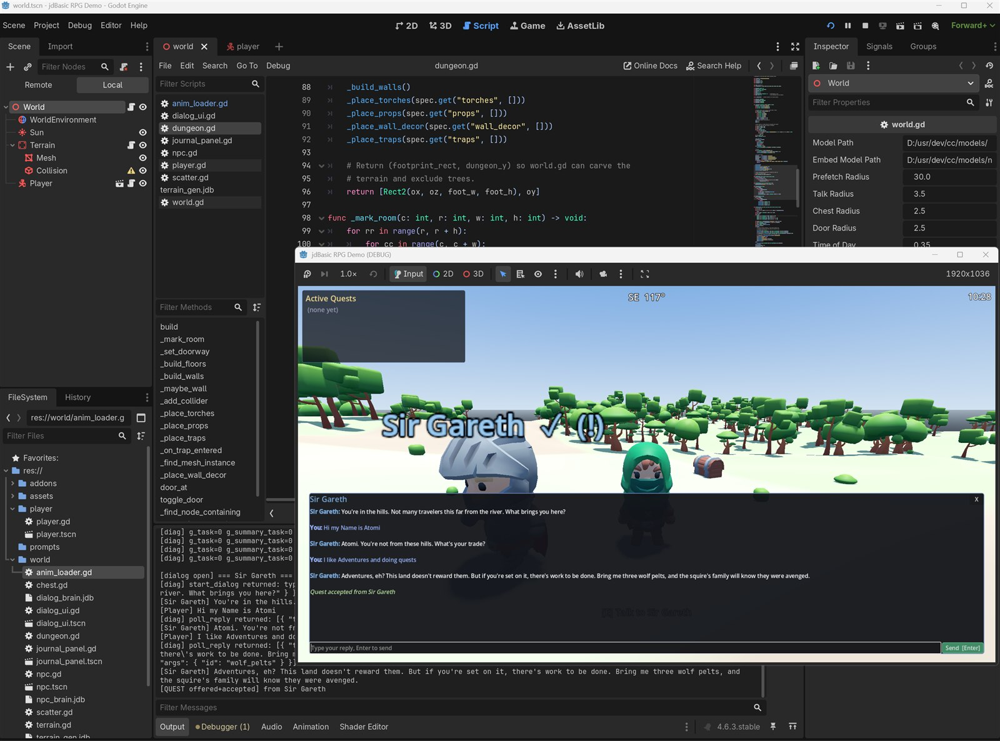
  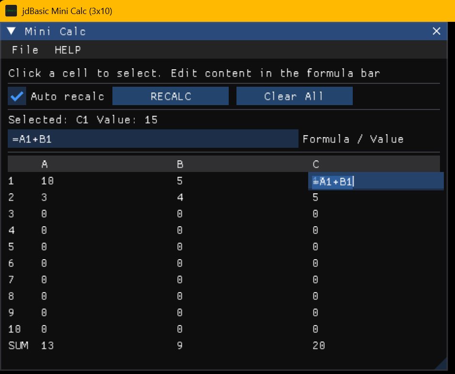
</p>
<p align="center">
  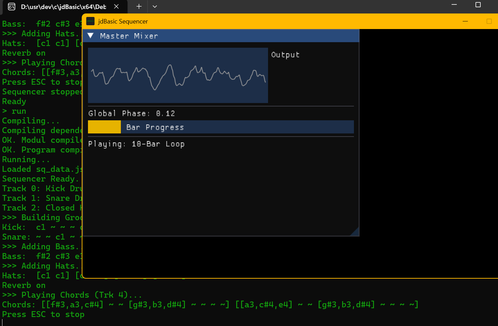
  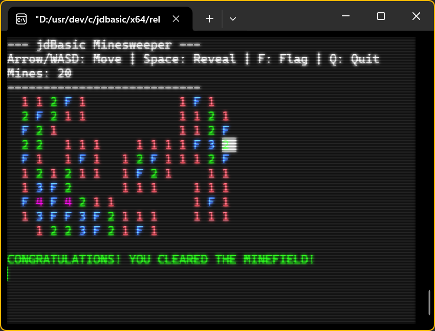
  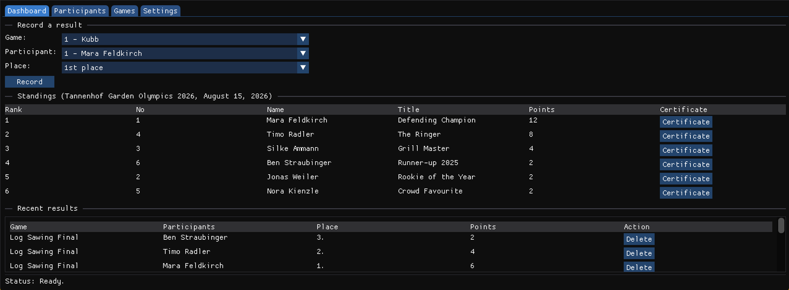
</p>
<p align="center"><em>An Apple II emulator, a Godot RPG with LLM characters, a spreadsheet, a live music sequencer, a terminal game and a real-world scoring app - all written in jdBasic. 250+ more programs in the <a href="jdb/README.md">sample gallery</a>.</em></p>

<details>
<summary><b>Everything in the box</b></summary>

- A **bytecode compiler and VM** with inline caches, opcode fusion and a refcounted value type
- **APL-style vectorization**: `SIN`, `+`, `*`, scatter/gather, `IOTA`, `REDUCE`, `SCAN`, `FILTER`, `SELECT` work on whole arrays
- **Linear algebra and DSP** backed by Eigen: `SVD`, `QR`, `DET`, `EIG`, `FFT`/`IFFT`
- **Native compiler** via LLVM: `jdbasic -c program.jdb` writes a standalone `.exe`
- **SDL3 graphics** with a batch plotter that pushes 70 000 coloured pixels per frame at 30+ FPS from BASIC ([`universe.jdb`](jdb/demos/graphics/universe.jdb))
- **Dear ImGui** for instant-mode tools, and **native Win32 forms** with a visual designer
- **Music sequencer** (`SOUND.*`) and an **FX chain** for guitar and synth effects
- **llama.cpp** for local LLMs, **ONNX Runtime** for ML models
- **HTTP/HTTPS** client and server, **COM** automation, **serial** I/O, SQLite
- **Reactive variables** (`->`), **hot reload**, a **persistent workspace** (`SAVEWS`/`LOADWS`)
- A **DAP debug adapter** and a VS Code extension with lint, hover and the form designer
- An **MCP server** (`jdbasic --mcp`) for Claude Code, Cursor, Cline and Co.
- The **Godot 4 embed**: a `.jdb` file is a Godot script, `GDX.*` reaches nodes, physics, 3D and audio ([`godot/`](godot/) has four projects; experimental)
- **Microcontroller ports** of the interpreter (RP2350, ESP32-S3), and a **kernel target** (`--target=kernel`) that compiles jdBasic into a freestanding x86-64 operating system
- A **module library** of 45 modules written in jdBasic itself

The original v1 codebase is kept on the [`legacy-v1`](https://github.com/AtomiJD/jdBasic/tree/legacy-v1) branch.
</details>

<details>
<summary><b>The 14 video lessons</b></summary>

The **Train jdBasic** series goes from "Hello, World" to native compilation in
5-10 minute episodes. The whole production - voice, screen recording, FFmpeg,
even the uploads - is itself a jdBasic program, see [`jdb/tv/`](jdb/tv/).

| # | Lesson | Topic |
|---|---|---|
| 01 | [Hello jdBasic](https://youtu.be/4qvPFoqxPHE) | PRINT, DIM, basic types |
| 02 | [If and For](https://youtu.be/RTI-f9cHldI) | IF/ELSE, FOR/NEXT, FizzBuzz |
| 03 | [Arrays](https://youtu.be/V33CGCt1zB8) | Vector ops, broadcasting, reductions |
| 04 | [Strings](https://youtu.be/NUhdrMU9T9c) | Slice, search, SPLIT |
| 05 | [Functions and SUBs](https://youtu.be/_4Q7qR1sA3Q) | FUNC, SUB, recursion |
| 06 | [Maps](https://youtu.be/vp0tCYa6__A) | Key-value data |
| 07 | [INPUT and DO Loops](https://youtu.be/1Sd7jCzY8Zc) | User-driven programs |
| 08 | [File I/O](https://youtu.be/gbFvgqIYNMM) | TXTWRITER, TXTREADER$ |
| 09 | [Graphics](https://youtu.be/qtBCNaVaRLA) | SCREEN, shapes, colours |
| 10 | [Modules](https://youtu.be/fg0ib3SgGio) | EXPORT, IMPORT, code reuse |
| 11 | [REPL Workflow](https://youtu.be/Noa4mqwEZ5w) | PRETTY, LINT, SAVEWS |
| 12 | [Higher-Order Functions](https://youtu.be/WPpzO0tHJNE) | SELECT, FILTER, REDUCE, lambdas |
| 13 | [HTTP and JSON](https://youtu.be/ecq8uZHAV7U) | Talk to the web |
| 14 | [Native Compilation](https://youtu.be/4DlthnUo56w) | Compile to .exe with `jdbasic -c` |
</details>

<details>
<summary><b>Project layout</b></summary>

```
src/        interpreter, compiler, VM (vm.cpp + vm_builtins_*.cpp), runtime modules
lib/        the module library, written in jdBasic - lib/README.md
jdb/        example programs - start at jdb/README.md
doc/        documentation - doc/README.md; screenshots in doc/img/
tests/      regression bank; tests/gate/ holds the pre-commit gate
embedded/   microcontroller ports (RP2350/PicoCalc, ESP32-S3) and bare metal
embed/      the Godot 4 GDExtension;  godot/ has the Godot projects
selfhost/   jdbc, a jdBasic compiler written in jdBasic
wasm/       the browser build behind jdbasic.org/live
fluppi/     "Vallys Reise", a complete top-down RPG
tools/      helper scripts (doc index, doc examples, syntax highlighting, ...)
bridges/    optional native bridges;  modules/  modules IMPORT finds by name
vscode_extension/  the VS Code extension (.vsix)
libs/       vendored third-party sources; SDL3, LLVM and the rest per doc/BUILD.md
```
</details>

## Contributing

Bug reports, ideas and code are welcome - [CONTRIBUTING.md](CONTRIBUTING.md)
has the build, the conventions and the pre-commit gate (four suites that must
report `0 failed` in the interpreter and, for compiler changes, as native
programs). The test bank is described in [tests/README.md](tests/README.md).

## License

**MIT** - see [LICENSE.txt](LICENSE.txt). Third-party components are listed in [THIRD_PARTY_LICENSES.txt](THIRD_PARTY_LICENSES.txt).
