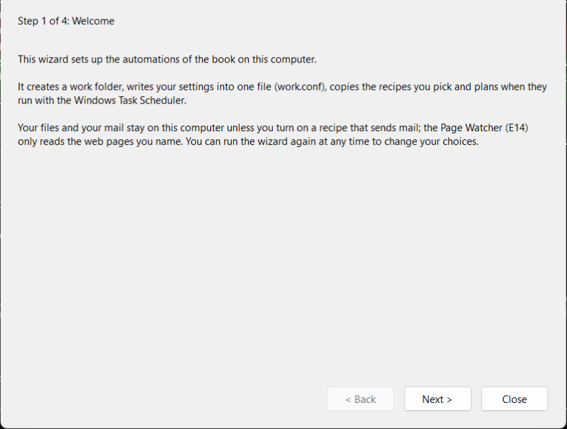
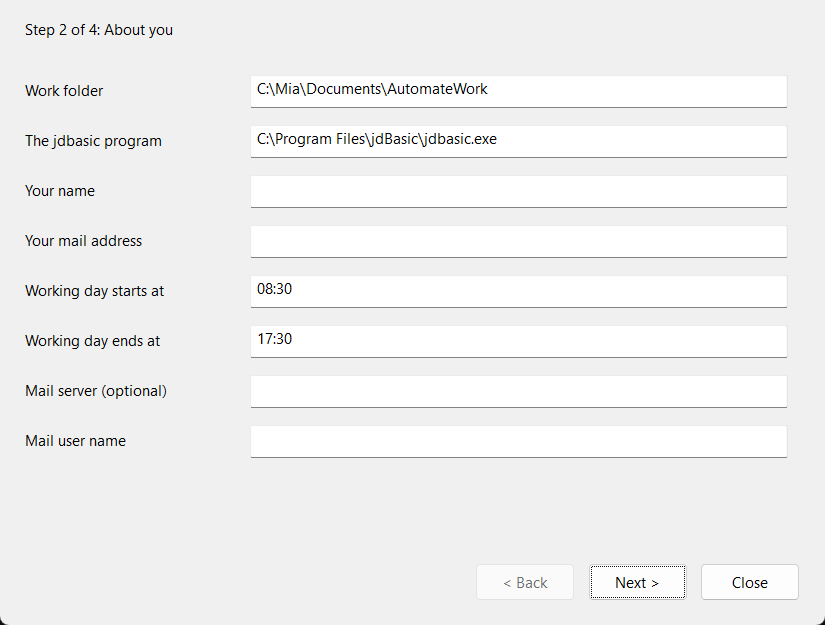
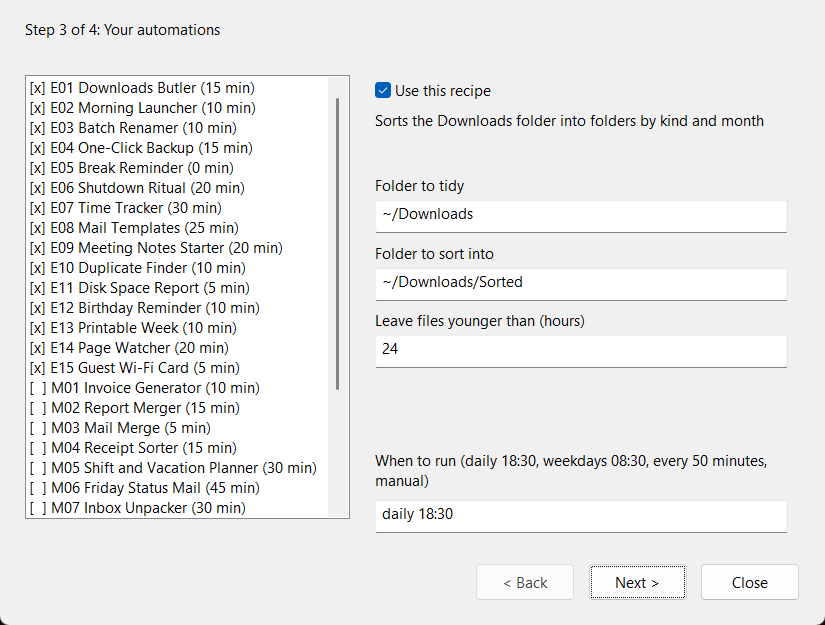
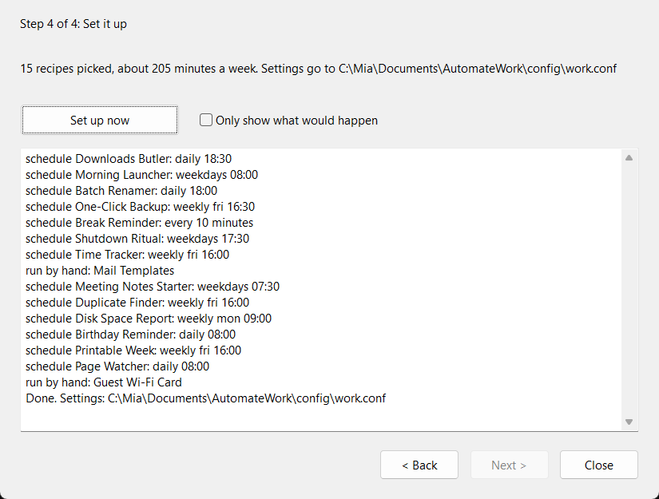

# Chapter 2: Your Toolbox

This chapter puts the tools on your computer and shows you how to use
them. It starts with what needs no programming at all: installing
jdBasic and running the setup wizard, which switches on the fifteen
automations of Chapter 3. Then it teaches the small part of jdBasic the
recipes are written in, the libraries they lean on, and how a program
runs on its own at a fixed time.

If you only want the easy recipes, the first two sections are enough.
Come back for the rest when you want a recipe to do one thing
differently, or when you reach Chapter 4.

## Installing jdBasic

jdBasic is a single program, `jdbasic.exe`, with a few libraries next to
it. It needs no administrator rights, no runtime to install first and no
account anywhere.

The book uses the release with Windows forms, because the setup wizard
opens a window. You find it on the releases page of the project,
`github.com/AtomiJD/jdBasic/releases`. Download the archive, unpack it
into a folder of your own, for example `C:\Users\mia\jdBasic`, and add
that folder to the PATH so that Windows finds `jdbasic` from any
command prompt:

1. Open the Start menu and type *environment variables*.
2. Choose *Edit environment variables for your account*.
3. Select *Path*, choose *Edit*, then *New*, and paste the folder.
4. Close every command prompt that was open; new ones see the change.

Check it in a new command prompt:

```
jdbasic --version
```

The answer names the version and the parts the release was built with.
*Forms* must be among them for the setup wizard.

> **Watch out**
> Some offices do not allow programs outside the folders IT installs. If
> Windows refuses to start `jdbasic.exe`, ask IT before you look for a
> way around it. Chapter 6 has a page on that conversation.

The recipes of the book come with the book: the folder `recipes` next to
the manuscript, or the download that goes with your copy. Unpack it
anywhere; the wizard copies what you choose into your work folder.

## The Setup Wizard

The wizard is the reason the easy level needs no programming. Start it
from the folder of the book's files:

```
jdbasic wizard\setup_wizard.jdb
```

It has four pages. You can go back and forth between them as often as
you like; nothing happens on your computer until you press *Set up now*
on the last page.



The first page explains the plan: a work folder, one settings file, the
recipes you choose, and a schedule for each of them. It also says what
the wizard never does: no recipe of the easy level sends anything over
the network.



The second page asks about you. The work folder is where your settings,
the copied recipes and their logs live; the suggestion inside Documents
is a good one. The wizard finds `jdbasic` on its own when it is on the
PATH. Your name and mail address go into the mail templates of E08, and
the working hours decide when E05 reminds you of breaks and when E06
asks its three questions at the end of the day. The mail server is
optional and only matters for the recipes of Chapter 4 that send mail;
leave it empty for now. The wizard never asks for a mail password:
recipes that send mail ask for it when you run them yourself, and
nothing writes it down.



The third page is the heart of the wizard. On the left are the recipes
with the minutes each one saves in a normal week; `[x]` marks the ones
that are switched on. At first these are the fifteen easy ones; the
recipes of Chapter 4 are listed below them and stay off until you
switch them on. Click a recipe to see its settings on the
right. Each setting has a label and a sensible default, such as the
folder the Downloads Butler tidies. At the bottom is the schedule:

- `daily 18:30` runs it every day at half past six in the evening,
- `weekdays 08:30` from Monday to Friday,
- `weekly fri 16:00` once a week,
- `every 50 minutes` again and again while you are logged in,
- `manual` (or an empty field) never on its own; you start it yourself.

Leave a recipe switched off if you are not sure about it. You can run
the wizard again at any time, and it remembers everything you chose.



The last page sums up what you picked and how many minutes a week that
promises. *Only show what would happen* lets you see the plan first.
*Set up now* creates the work folder, writes the settings file, copies
the recipes, and adds one task per recipe to the Windows Task Scheduler,
in a folder of its own called *AutomateWork*.

> **Try this**
> Run the wizard with *Only show what would happen* ticked first. It
> lists every schedule without touching anything. When the list looks
> right, untick it and set up for real.

### The settings file

Everything you chose ends up in one text file, `work.conf`, in the
`config` folder of your work folder. It is written in TOML, a format for
settings that reads like a list of name and value pairs grouped under
headings in brackets:

```toml
[user]
name = "Mia Example"
day_start = "08:30"
day_end = "17:30"

[downloads_butler]
source = "~/Downloads"
target = "~/Downloads/Sorted"
min_age_hours = 24
```

Every recipe reads its own part, the one under its heading. `~` stands
for your home folder. Text goes in double quotes, numbers and `true` or
`false` do not. Inside double quotes a backslash starts a special
character, so write folders with forward slashes, `"C:/Users/mia/Scans"`,
which Windows understands as well. You can change this file with any
text editor; the next run of a recipe uses the new values, and the next
run of the wizard shows them.

### The wizard without a window

On a computer without the forms release, or if you prefer the command
prompt, the same wizard runs in the console. It asks the same questions
one after the other, with the current answer in brackets; Enter keeps
it:

```
jdbasic wizard\setup_console.jdb
```

Two switches help later on. `--doctor` checks an existing setup and
lists what is missing, a moved folder or a deleted task, for example.
`--uninstall` removes the scheduled tasks and leaves your files and your
settings alone.

## Your First Program

A jdBasic program is a text file that ends in `.jdb`. Open Notepad,
type the four lines below, save them as `hello.jdb` in your work folder,
and run them from a command prompt in that folder with
`jdbasic hello.jdb`. The second box shows what appears:

```basic
DIM who$ = "Mia"
DIM day = CDATE("2026-10-05 08:30:00")
PRINT "Good morning, " + who$ + "."
PRINT "Today is " + FORMAT_DATE(day, "%A, %d %B %Y") + "."
```

```text
Good morning, Mia.
Today is Monday, 05 October 2026.
```

That is the whole cycle: write lines, save, run, read what it printed.
Every program in this book works this way, the large ones included.
Change `"Mia"` to your own name and run it again. Then replace the
fixed date with `NOW()`, the date and time of the moment the program
runs, and it greets you with today.

The next section explains every word of these four lines, and the
rest of what the recipes use.
