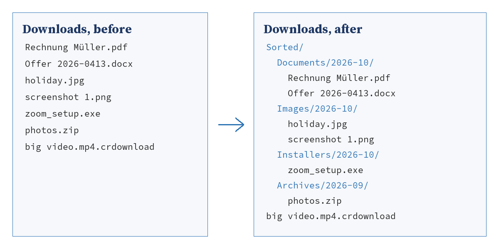

# Chapter 3: Easy: Fifteen Automations You Switch On

The fifteen recipes in this chapter need no programming. The setup wizard
from Chapter 2 copies them to your work folder, asks you a few questions
and plans when each one runs. What you can change lives in one file,
`work.conf`, and every recipe tells you which lines in it belong to it.

You will still see the programs. Each recipe prints the program that does
the work, and a short walk through it. Read it once: a program you have
read is a program you trust, and the day you want it to do one thing
differently you will know where to look.

Each recipe follows the same order:

1. **The chore**: what it costs you now.
2. **What you get**: the result in one picture or one sentence.
3. **Before you start**: what has to be in place.
4. **The program**: the code, exactly as it was tested.
5. **How it works**: the program step by step.
6. **Run it**: the command and what it prints.
7. **Schedule it**: how it runs without you.
8. **Make it yours**: the settings you can change.
9. **When it goes wrong**: the problems you are likely to meet.
10. **Balance dividend**: the time it gives back.

<!-- pagebreak -->

## E01 Downloads Butler

### The chore

Mia is a project assistant. Every file anyone sends her ends up in the
Downloads folder: invoices, offers, photos from the last site visit, the
installer for the video call tool, the zip file with last year's figures.
On Monday morning the folder holds three hundred files. Finding the offer
for the Miller project means scrolling, sorting by date, guessing at
names, and opening two wrong PDFs first.

Once a month Mia spends half an hour tidying it up. By the middle of the
next week it looks the same as before.

### What you get

Every night the Downloads Butler looks at the Downloads folder. Each file
that has rested there for a day moves into a folder for its kind and the
month it arrived: documents to `Sorted/Documents/2026-10`, photos to
`Sorted/Images/2026-10`, and so on. Downloads that are still running stay
where they are, and so does anything that arrived today, because that is
the file you are most likely to need next.



### Before you start

The setup wizard has run and the Downloads Butler is switched on. That
is all; the wizard found your Downloads folder and wrote it into
`work.conf`.

### The program

The recipe has two files. The first is the program the wizard runs. It
reads the settings, asks the butler for a plan and carries it out:

<!-- include recipes/easy/E01_downloads_butler/downloads_butler.jdb -->

The second file is the butler itself. It knows which extension belongs to
which kind of file, which files to leave alone, and how to find a free
name when a file of the same name is already in the target folder:

<!-- include recipes/easy/E01_downloads_butler/butler.jdb -->

### How it works

1. `WORKCONF.SETTINGS` reads `work.conf`. The program takes four values
   from it: the folder to tidy, the folder to sort into, how old a file
   must be, and the list of kinds. Each has a default, so a short
   `work.conf` works too.
2. `BUTLER.PLAN` looks at every entry of the Downloads folder with `DIR$`.
   It skips folders, hidden files and partial downloads such as
   `.crdownload`, and every file younger than `min_age_hours`.
3. For each file that stays in the plan, `KIND$` finds its kind from the
   extension, and the first seven characters of its change date give the
   month, such as `2026-10`.
4. `FREE_NAME$` makes sure nothing is overwritten. If `holiday.jpg` is
   already in the target folder, the new one becomes `holiday (2).jpg`.
5. `BUTLER.APPLY` creates the folders with `MKDIR` and moves each file
   with `FILE.MOVE`. With `--dry-run` it only prints what it would do.

Planning first and moving second is a habit worth copying for every
program that changes files: the plan can be shown, checked and tested
before anything happens.

### Run it

Try it with `--dry-run` first. Nothing moves; you see the plan:

```
jdbasic downloads_butler.jdb --dry-run
would move holiday.jpg -> Images\2026-10\holiday.jpg
would move budget.xlsx -> Documents\2026-10\budget.xlsx
2 files would move. Run without --dry-run.
```

When the plan looks right, run it without the switch.

### Schedule it

The wizard plans the Downloads Butler for every evening at 18:30. To pick
another time, run the wizard again and change it on the page "Schedule".

### Make it yours

The butler's settings are in the part of `work.conf` that starts with
`[downloads_butler]`:

```toml
[downloads_butler]
source = "~/Downloads"
target = "~/Downloads/Sorted"
min_age_hours = 24

[downloads_butler.rules]
Documents = ["pdf", "docx", "xlsx", "pptx", "txt", "csv"]
Images = ["jpg", "jpeg", "png", "heic"]
"Audio and Video" = ["mp3", "mp4", "mov"]
Archives = ["zip", "7z"]
Installers = ["exe", "msi"]
```

- **Sort into your Documents folder** instead of a folder inside
  Downloads: set `target = "~/Documents/From Downloads"`.
- **Keep files longer**: `min_age_hours = 72` leaves everything of the
  last three days where it is.
- **Add a kind**: a line such as `CAD = ["dwg", "dxf", "step"]` under
  `[downloads_butler.rules]` gives drawings their own folder. Files with
  an extension no rule names go to `Other`.

### When it goes wrong

- **"No settings found"**: the program did not find `work.conf`. Run the
  wizard, or give the file with `--config path\to\work.conf`.
- **A file stays where it is**: it is younger than `min_age_hours`, it is
  hidden, or its name ends in `.crdownload` or `.part`, which browsers use
  while a download is running.
- **"target exists"**: two files with the same name arrived in the same
  run and something created the second one in between. Run the butler
  again; it picks the next free name.

> **Balance dividend**
> About 15 minutes a week of tidying and searching, and the half hour
> once a month that the folder used to cost you.
