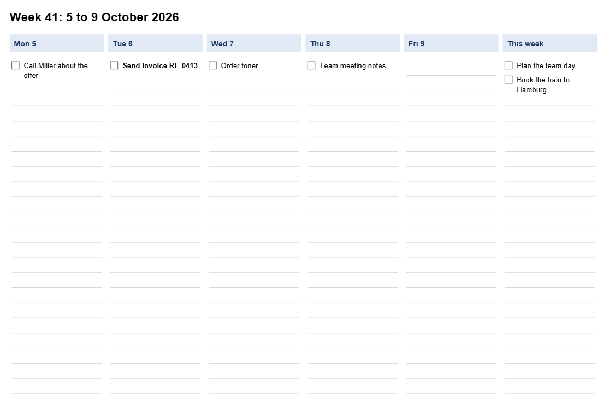

<!-- pagebreak -->

## E13 Printable Week

### The chore

Mia keeps her to-do list in a text file. It is quick to write and easy
to search, but on Monday morning she wants the week on paper next to the
keyboard, a box to tick for each task and room to scribble. So every
Friday she copies the list into a table in Word, sorts the tasks by day,
fixes the column widths and prints it. That takes a quarter of an hour,
and by Wednesday the paper is out of date anyway.

### What you get

Every Friday afternoon the Printable Week turns the to-do list into one
landscape page for the coming week: a column per day, a column for the
tasks that belong to the week as a whole, a box before every task and
light lines below for what comes up during the week. Important tasks are
set in bold.



### Before you start

The setup wizard has run and the Printable Week is switched on. Your
to-do list is a plain text file, by default `todo.txt` in your work
folder, with one task per line:

```
Mon: Call Miller about the offer
Tue: ! Send invoice RE-0413
Wed: Order toner
Plan the team day
# a line starting with # is a note to yourself
```

A day before the colon puts the task on that day; `Mon`, `monday` and
`Monday` all work. A `!` marks a task important. A line without a day
belongs to the whole week.

### The program

The program reads the settings, finds the Monday of the week, asks the
planner for the plan and writes the page:

<!-- include recipes/easy/E13_printable_week/printable_week.jdb -->

The planner reads the list, sorts the tasks into columns and draws the
page with PDFGEN:

<!-- include recipes/easy/E13_printable_week/planner.jdb -->

### How it works

1. `PLANNER.PARSE` reads the list line by line. When the word before
   the first colon names a day, the task belongs to that day; anything
   else, such as `Note: call back`, keeps its colon and goes to the week.
2. `PLANNER.MONDAY` finds the Monday of the week a date falls in. The
   program asks for the week `weeks_ahead` weeks from today, so a run on
   Friday plans the next week.
3. `PLANNER.PLAN` makes a column per day and one for the week. With five
   days, tasks for Saturday and Sunday go to the week's column.
4. `PLANNER.WRITE` draws the page: a shaded heading per column, a box and
   the wrapped text for every task, and ruled lines below. A column that
   runs out of room ends with a line such as `+ 3 more`, so no task
   disappears without a trace.

### Run it

With `--dry-run` the program shows the plan and writes nothing:

```
jdbasic printable_week.jdb --dry-run
Week 41: 5 to 9 October 2026
  Mon 5: 1 task
  Tue 6: 1 task
  Wed 7: 1 task
  Thu 8: 1 task
  Fri 9: 0 tasks
  This week: 2 tasks
```

Without the switch it also writes `Week 41.pdf` into the folder for
printable pages. Open it and print it.

### Schedule it

The wizard plans the Printable Week for every Friday at 16:00, so the
page for the next week is waiting when you pack up. Change the time on
the wizard's page "Schedule".

### Make it yours

The settings are in the `[printable_week]` part of `work.conf`:

```toml
[printable_week]
todo_file = "~/Documents/AutomateWork/todo.txt"
out_folder = "~/Documents/AutomateWork/print"
days = 5
weeks_ahead = 1
```

- **Plan the weekend too**: `days = 7` adds Saturday and Sunday.
- **Print this week instead of the next**: `weeks_ahead = 0`, useful when
  the program runs on Monday morning.
- **Keep the list elsewhere**: point `todo_file` to the file you already
  use, for example in a synced folder.

### When it goes wrong

- **"No to-do list"**: `todo_file` names a file that does not exist.
  Create it or correct the path.
- **A task is on the wrong day**: check the word before the colon. Only
  the first three letters count, so `Mo:` is not Monday.
- **"tasks did not fit"**: a day holds more than the column takes. Move
  some tasks to the week or split the day.

> **Balance dividend**
> About 10 minutes every Friday, and a Monday that starts with the week
> already on paper.
