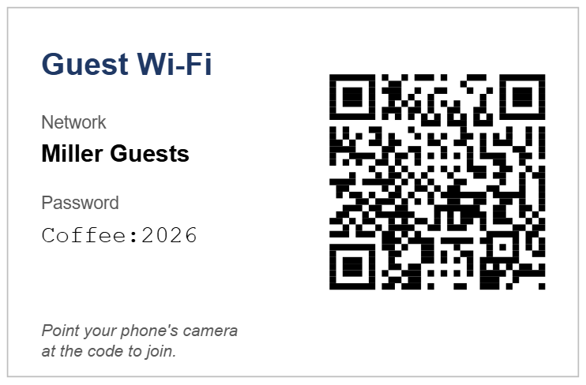

<!-- pagebreak -->

## E15 Guest Wi-Fi Card

### The chore

Visitors come to Mia's office every day, and almost every one of them
asks for the Wi-Fi. Mia spells out the network name, then the password,
twice, because "the second letter is a capital and the zero is a zero".
The card she once wrote by hand has gone missing from the meeting room.

### What you get

A page of eight cards to cut out and put on the tables in the meeting
rooms. Each card shows the network's name and password, and a QR code.
A visitor points the phone's camera at the code and the phone offers to
join the network; nobody has to type anything.



### Before you start

The setup wizard has run and asked for the name and the password of the
guest network. If your office has no guest network, ask whoever runs the
Wi-Fi to set one up: a guest network keeps visitors away from the
computers and printers of the office, and its password can be printed
without worry.

### The program

The program reads the network's details, builds the text of the QR code
and writes the page of cards:

<!-- include recipes/easy/E15_guest_wifi/guest_wifi.jdb -->

The card module knows the Wi-Fi code format and draws the cards with the
QR module on a PDFGEN page:

<!-- include recipes/easy/E15_guest_wifi/wificard.jdb -->

### How it works

1. Phones read a Wi-Fi QR code as one line of text such as
   `WIFI:T:WPA;S:Miller Guests;P:Coffee\:2026;;`. `T` is the kind of
   security, `S` the network's name, `P` the password.
2. In that line the characters `\ ; , :` and the double quote have a
   meaning of their own, so `WIFICARD.ESCAPE$` puts a backslash before
   each of them when they are part of the name or the password. Without
   it, the colon in `Coffee:2026` would cut the password short.
3. `WIFICARD.PAYLOAD$` puts the parts together. WPA2 and WPA3 networks
   are written as `WPA`, which is what phones expect; an open network has
   no password at all.
4. `WIFICARD.SHEET` makes the QR code with `QR.MATRIX` once and draws it
   on every card with `QR.TOPDF`, next to the name and the password.

### Run it

Try `--dry-run` first: it prints the code's text and the code itself in
the terminal. Scan the screen with your phone to check it before you
print:

```
jdbasic guest_wifi.jdb --dry-run
WIFI:T:WPA;S:Miller Guests;P:Coffee\:2026;;
```

Without the switch the program writes `guest_wifi.pdf` with eight cards:

```
jdbasic guest_wifi.jdb
Wrote 8 cards to
    C:\Users\mia\Documents\AutomateWork\print\guest_wifi.pdf
```

### Schedule it

Not at all: the cards stay right until the password changes. Run the
program again after a change; the wizard leaves this recipe unscheduled.

### Make it yours

The settings are in the `[guest_wifi]` part of `work.conf`:

```toml
[guest_wifi]
ssid = "Miller Guests"
password = "Coffee:2026"
security = "WPA"
cards = 8
out_file = "~/Documents/AutomateWork/print/guest_wifi.pdf"
```

- **One large card for the reception desk**: `cards = 1`.
- **An open network**: `security = "nopass"`; the card then shows
  `(none)` as the password.
- **A hidden network**: add `hidden = true`, and phones look for it even
  though it does not announce its name.

### When it goes wrong

- **"Set guest_wifi.ssid"**: the network's name is missing in
  `work.conf`.
- **The phone does not offer to join**: scan the `--dry-run` code and
  compare the text with the settings. A wrong security kind is the usual
  cause; `WEP` networks are rare today.
- **A character shows as `?` on the card**: the card uses the PDF
  standard fonts, which know the letters of Western European languages.
  The QR code itself is still right.

> **Balance dividend**
> About 5 minutes a week of spelling passwords, and visitors who are on
> the network before the coffee arrives.
