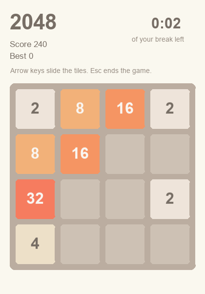

<!-- pagebreak -->

## Bonus: E17 Break Arcade

### The chore

The Break Reminder (E05) tells Mia when it is time for a break. She
gets up, fetches a coffee, and is back at her desk two minutes later,
where the inbox is already waiting. The break counts on paper, but her
head never left work. What she needs is something that takes her mind
off the job for a few minutes and then lets her go.

### What you get

A round of 2048 in a window of its own. You slide numbered tiles with
the arrow keys; two equal tiles join into one with twice the value,
and every join scores. The game knows how long your break is. A clock
counts it down, and when it reaches zero the game says the break is
over, shows your score, keeps your best one, and closes.



### Before you start

The setup wizard has run. The Break Arcade needs no settings to start:
a break of three minutes and a file for your best score in the work
folder are the defaults. It opens a graphics window, so it needs the
release of jdBasic you installed in Chapter 2; nothing else.

### The program

The program draws the board, reads the arrow keys, and watches the
clock:

<!-- include recipes/easy/E17_break_arcade/break_arcade.jdb -->

The rules of the game are a module of their own. Each function takes a
board and answers a new one, so a test can play any situation without
a window:

<!-- include recipes/easy/E17_break_arcade/arcade.jdb -->

### How it works

1. A board is a list of four rows of four numbers, 0 for an empty
   cell. `ARCADE.SLIDE_ROW` slides one row to the left: it gathers
   the tiles, joins two equal neighbours into one, and fills the rest
   with zeros. A tile that was just made by a join does not join again
   in the same move, which is what makes 2048 a game of planning.
2. `ARCADE.MOVE` uses that one function for all four directions. For a
   move to the right it turns each row around, slides it, and turns it
   back. For up and down it swaps rows and columns first.
3. After every move that changed something, `ARCADE.SPAWN` puts a 2,
   or now and then a 4, into a free cell. The cell comes from a
   seeded sequence of numbers, so the same seed always gives the same
   game. The test uses that to play a game twice and compare.
4. The main loop asks `INKEY$` for the last key, turns an arrow into a
   direction with `ARCADE.KEY_DIR$`, and draws the board again. `TICK`
   gives the milliseconds since the game began; the difference to the
   length of the break is the clock at the top right.
5. When no move can change the board any more, `ARCADE.CAN_MOVE` says
   so, and Enter starts a new game. When the clock reaches zero, the
   game shows its last screen, `ARCADE.KEEP_BEST` writes the score into
   the file if it beats the old best, and the window closes.

### Run it

```
jdbasic break_arcade.jdb
```

The window opens and the clock starts. Slide with the arrow keys or
with W, A, S and D. Esc ends the game early; the best score still
counts. With `--selftest` the game plays a round of its own, about
four seconds long, checks that the moves scored and the best score was
kept, and closes again. It is how the test of this recipe knows that
the window works.

### Schedule it

A game has no schedule; it is there when you want a break. Start it by
hand, from a shortcut on the desktop that runs
`jdbasic break_arcade.jdb`, or from a button of the Work Cockpit
(X06). A good moment is right after the Break Reminder (E05) has
asked you to stand up: stretch first, then play one round.

### Make it yours

The settings are the `[break_arcade]` part of `work.conf`:

```toml
[break_arcade]
minutes = 3
best_file = "~/Documents/AutomateWork/arcade_best.txt"
```

- **A longer break.** `minutes = 10` gives you ten minutes, which is
  about one good game.
- **A fresh start.** Delete the file in `best_file` and the best score
  starts again from zero.
- **Other colours.** `TileColour` in the program holds the colour of
  every tile as red, green and blue from 0 to 255. Change a line and
  the next game uses it.
- **A bigger goal.** The game ends only when the clock does. If you
  would rather stop at a tile, compare `ARCADE.TOP_TILE` with 2048 in
  the main loop and end the round there.

### When it goes wrong

- **The window opens and closes at once**: jdBasic found no graphics.
  Check that `jdbasic --version` lists *GFX*; the release of Chapter 2
  has it.
- **The arrow keys do nothing**: another window has the focus. Click
  into the game window once.
- **The numbers look plain**: the game looks for the fonts Arial and
  Arial Bold of Windows and falls back to the built in font when they
  are missing. It still works the same.

> **Balance dividend**
> No minutes saved this time. The dividend is a break that really is
> one: three minutes in which work is not on your mind, and a clock
> that sends you back without guilt.
