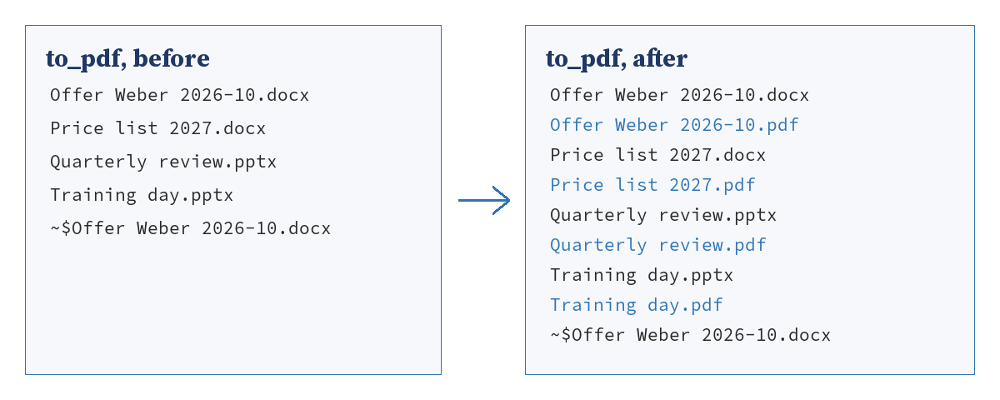

<!-- pagebreak -->

## Bonus: E18 Office to PDF

### The chore

Mia sends offers and price lists to customers, always as PDF, because
a Word file looks different on every computer and invites changes.
So every offer ends the same way: *File, Save As*, pick PDF, find the
folder, click Save, and for the slides of a training day the same in
PowerPoint. When she changes a price an hour later, she does it all
again, and now and then the customer gets the PDF of the old version.

### What you get

You keep your Word and PowerPoint files in one folder. Office to PDF
puts a PDF next to each of them that has none yet, or whose PDF is
older than the document. Word and PowerPoint make the PDFs
themselves, so they look exactly like what you see on the screen.
The programs work without a window and are closed again when the
recipe is done.



### Before you start

The setup wizard has run, and you have a folder for the documents, by
default `to_pdf` in your work folder. Any folder works; many people
point the recipe at the folder where their offers already live.

> **Watch out**
> The recipe needs Word and PowerPoint installed and licensed on this
> computer, the desktop versions of Microsoft Office. It starts them
> under your own account, the way you start them, so it runs from the
> Task Scheduler while you are logged in and not as a Windows service.
> A document that is open in Word while the recipe runs is still
> converted; the PDF shows the last saved state.

### The program

The program reads the settings, asks the module which documents need
a PDF and lets it make them:

<!-- include recipes/easy/E18_office_to_pdf/office_to_pdf.jdb -->

The module plans the work first and then talks to Office:

<!-- include recipes/easy/E18_office_to_pdf/topdf.jdb -->

### How it works

1. `TOPDF.PLAN` lists the folder and keeps the files Word
   (`.docx`, `.doc`, `.rtf`, `.odt`) and PowerPoint (`.pptx`, `.ppt`,
   `.odp`) open.
   Files starting with `~$` are Office's own lock files and are left
   out.
2. For each document, `OFFICEKIT.NEEDS_PDF` compares the time it was
   last saved with the time of its PDF. A missing or older PDF means
   `convert`, a newer one `current`.
3. `TOPDF.APPLY` groups the documents by program, so Word starts once
   for all Word files and PowerPoint once for all slides. For each
   program `FILTER` keeps the documents of that kind that need a PDF;
   `USE(kind$)` hands the lambda the program it looks for.
   `CREATEOBJECT` starts the program, and `OFFICEKIT.PREPARE` hides
   its window and turns off its questions.
4. `OFFICEKIT.SAVE_PDF` opens the document read only, so it is never
   changed, saves it as PDF and closes it again. A document that
   Office cannot open is named in a `skipped` line and the others go
   on.
5. `OFFICEKIT.CLOSE_APP` quits the program, and `RELEASEOBJECT` lets
   go of it, so no Word stays behind in the background.

The library OFFICEKIT in `recipes/lib` holds what the Office recipes
share; Excel Refresh (M18) and the Outlook Bridge (X19) use it too.

### Run it

See what would happen first:

```
jdbasic office_to_pdf.jdb --dry-run
would make Offer Weber 2026-10.pdf
would make Price list 2027.pdf
would make Quarterly review.pdf
would make Training day.pdf
4 PDFs would be made. Run without --dry-run.
```

Then without `--dry-run`. You see a `made` line per PDF, and a few
seconds per document. A second run right after it says that every PDF
is up to date.

### Schedule it

The wizard plans it daily at noon. If you change documents all day
long, an hourly run works as well, since a run with nothing to do
starts no Office program at all.

### Make it yours

The settings are the `[office_to_pdf]` part of `work.conf`:

```toml
[office_to_pdf]
source = "~/Documents/AutomateWork/to_pdf"
target = ""
programs = ["word", "powerpoint"]
```

- **All PDFs in one place.** Set `target` to a folder, for example the
  one you share with your colleagues, and the PDFs land there instead
  of next to the documents.
- **Workbooks too.** Add `"excel"` to `programs`, and every workbook
  becomes a PDF of all its sheets. Excel Refresh (M18) does more for a
  single report workbook.
- **Only Word.** Leave out `"powerpoint"` when your slides are not
  meant for customers.

### When it goes wrong

- **"Every PDF is up to date" although you changed a document**: the
  document was not saved yet. Save it and run again.
- **"skipped Offer.docx: ..."**: Word could not open the file, most
  often because it is damaged or protected by a password. Open it by
  hand to see what Word says.
- **"COM: Cannot find ProgID 'Word.Application'"** at the start:
  Word or PowerPoint is not installed on this computer, or only the
  web version is. The recipe needs the desktop programs.
- **A WINWORD.EXE stays in the Task Manager**: the recipe was stopped
  in the middle, for example with Ctrl+C. End that process in the
  Task Manager; the next run starts a fresh one.

> **Balance dividend**
> About 15 minutes a week for anyone who sends documents as PDF, and
> no more customers who get the PDF of yesterday's version.
