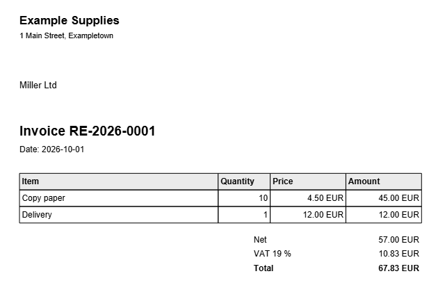

<!-- pagebreak -->

## M01 Invoice Generator

### The chore

Jonas's team sells supplies to a handful of regular customers. At the
end of every month someone writes the invoices: open last month's Word
file, change the number, type the customer, copy the lines from the
order sheet, add up, add the VAT, save as PDF, write a mail, attach,
send. Eight customers, eight times the same twenty steps, and once a
quarter a number is used twice or a total does not match the lines.

### What you get

You keep the month's orders in one Excel sheet, one row per item. The
Invoice Generator turns the rows of each customer into one invoice
with the next free number, the lines, the net amount, the VAT and the
total, as a PDF or a Word file. For every customer with a mail address
it puts a ready mail with the invoice attached into the outbox.



### Before you start

The setup wizard has run, and the outbox rule of this chapter is set
up, with your name and address as `from` in `[mail]`. You need one
Excel file with a sheet like this one; the order of the columns does
not matter, their names do:

| Customer | Email | Item | Quantity | Price |
|---|---|---|---|---|
| Miller Ltd | buy@miller.example | Copy paper | 10 | 4.50 |
| Stone and Co | office@stone.example | Toner | 2 | 61.90 |
| Miller Ltd | | Delivery | 1 | 12.00 |

A customer can have as many rows as there are items. The mail address
is taken from the customer's first row.

### The program

The program reads its settings, the sheet and the counter, and then
either shows the invoices, writes them, or sends the mails that wait:

<!-- include recipes/medium/M01_invoice_generator/invoice_generator.jdb -->

The module `INVOICES` does the work that does not depend on where the
data comes from: grouping, adding up, numbering, the rows of the table
and the mail:

<!-- include recipes/medium/M01_invoice_generator/invoices.jdb -->

Two small modules turn an invoice into a file. `INVOICE_PDF` places it
on a page; `INVOICE_WORD` does the same with DOCX and is in the recipe
folder:

<!-- include recipes/medium/M01_invoice_generator/invoice_pdf.jdb -->

### How it works

1. **Settings.** The program reads its part of `work.conf`. Every value
   has a default, so a short `[invoice_generator]` part works. The
   sender comes from the shared mail settings through `OUTBOX.FROM$`.
2. **The sheet.** `XLSX.READ` reads the whole workbook into a map from
   sheet name to rows. Without a `tab` setting the program takes the
   first sheet. Numbers in the sheet arrive as numbers, text as text.
3. **Finding the columns.** `COLUMNS` looks at the first row and notes
   where each of the five column names stands. That is why the order of
   the columns does not matter, and why a renamed column stops the
   program with a message that names it instead of producing wrong
   invoices.
4. **Grouping.** `GROUP` walks the rows and keeps a map from customer
   name to the position of that customer's invoice. The first row of a
   customer starts an invoice; every further row adds a line to it.
   Rows without a customer, such as an empty line at the end, are left
   out.
5. **Adding up.** `TOTALS` multiplies quantity and price of every line
   in one `SELECT`, adds the results with `SUM`, and rounds to cents.
   The VAT is computed from the unrounded net amount and rounded once,
   which is how a calculator would do it.
6. **Numbers.** `NEXT_NUMBERS` reads the last number used from
   `last_number.txt` in the invoice folder and hands out the next ones:
   `last + IOTA(n)` is the list of the next n numbers, and a `SELECT`
   turns each into a text such as `RE-2026-0007`. The program writes
   the new last number back only after all invoices are written, so a
   run that stops halfway does not burn numbers.
7. **Files.** `INVOICE_PDF.WRITE` places the parts on an A4 page with
   PDFGEN: your company at the top, the customer, the number and the
   date, the table of lines and the three totals. `INVOICE_WORD.WRITE`
   writes the same content as a Word file, for customers who want to
   edit it. Both take their rows from `TABLE_ROWS`, which makes one row
   per line with a `SELECT`, and from `TOTAL_LINES`, so the two files
   always agree.
8. **Mail.** `MAIL_FOR` builds the message with the invoice attached,
   and `OUTBOX.PUT$` writes it into the outbox under the invoice's
   number.

### Run it

Look first:

```
jdbasic invoice_generator.jdb --dry-run
would write RE-2026-0001  Miller Ltd  67.83 EUR
would write RE-2026-0002  Stone and Co  147.32 EUR
```

Then write:

```
jdbasic invoice_generator.jdb
wrote RE-2026-0001  Miller Ltd  67.83 EUR
wrote RE-2026-0002  Stone and Co  147.32 EUR
The mails wait in the outbox. Send them with --send.
```

Open one of the `.eml` files in the outbox to check it, then send all
of them:

```
jdbasic invoice_generator.jdb --send
```

### Schedule it

Invoices are something you start yourself when the month's sheet is
complete, so the wizard plans no task for this recipe. If your sheet
is always complete on the first of the month, give it a schedule such
as `daily 07:00` and let it run only on the first (see *Make it yours*).

### Make it yours

The settings:

```toml
[invoice_generator]
sheet = "~/Documents/AutomateWork/invoices.xlsx"
tab = "October"
folder = "~/Documents/AutomateWork/invoices"
prefix = "RE-"
format = "pdf"
vat_percent = 19
company = "Example Supplies"
address = "1 Main Street, Exampletown"
```

`format = "docx"` writes Word files instead of PDF. One sheet per
month, with `tab` set to the month, keeps last month's rows from being
invoiced twice.

Changes in the code:

- **A line under the totals,** such as your bank details: in
  `INVOICE_PDF.WRITE`, after the loop that writes the totals, add
  `PDFGEN.TEXTAT(pdf, 20, PDFGEN.POSY(pdf) + 10, "IBAN ...")`.
- **Run only on the first of the month:** at the top of the program,
  after the settings, add
  `IF FORMAT_DATE(NOW(), "%d") <> "01" THEN END`, and schedule it daily.
- **Numbers that start again every year:** in `NEXT_NUMBERS`, keep one
  counter file per year by naming it `"last_" + year$ + ".txt"` in the
  program, where `counter$` is set.
- **No VAT for some customers:** add a column `VAT` to the sheet, read
  it in `GROUP` like the other columns, store it in the invoice map, and
  pass `inv{"vat_rate"}` instead of `vat` to `TOTALS`.
- **The mail text:** it is built in `MAIL_FOR`, four short lines you
  can change freely.

### When it goes wrong

- **"The sheet has no column price"**: a column was renamed or the
  first row is not the header. The five names must appear in the first
  row, in any case.
- **Numbers jumped**: the counter in `last_number.txt` is the only
  memory of the generator. Do not delete it; to start over, write the
  number you want to come before the next one into it.
- **A customer got two invoices**: the name was written two ways, such
  as `Miller Ltd` and `Miller Ltd.`. Grouping compares names exactly.
- **The mail is missing**: the customer's first row has no address.
  The invoice file is written all the same.

> **Balance dividend**
> About 40 minutes a month for eight customers, ten a week, and no
> invoice number used twice.
