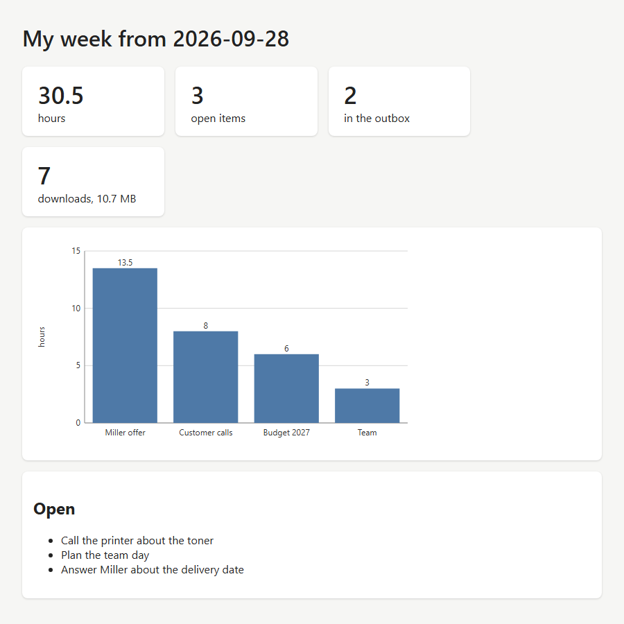

<!-- pagebreak -->

## M08 Personal Dashboard

### The chore

On Friday afternoon Jonas wants to know where his week went. The
hours are in the time tracker's log, the open items in his notes
file, the mails he still has to send in the outbox, and the
downloads folder fills up without him noticing. Finding each number
means opening four places, so he rarely looks.

### What you get

A web page on your own computer that shows all of it at once: the
hours of this week, a bar chart of the hours per project, the number
of open items with the list below, the mails waiting in the outbox,
and how many files lie in the downloads folder and how much space
they take. The page refreshes itself every five minutes.



The page is served by a small web server inside the program. It
listens only on this computer, at `localhost`, so nobody else on the
network can open it, and nothing goes to the internet.

### Before you start

The dashboard reads what other recipes write:

- the log of the time tracker (E07), from the `[time_tracker]` part
  of `work.conf`;
- a notes file with open items written `- [ ] item`, the same check
  boxes as in the Friday status mail (M06);
- the outbox from the `[mail]` part, as the outbox rule of this
  chapter describes.

None of them is required. A missing log shows zero hours, a missing
notes file no open items.

### The program

The program reads the settings and either serves the page or saves
it once as a file:

<!-- include recipes/medium/M08_personal_dashboard/personal_dashboard.jdb -->

The module collects the numbers and answers the browser:

<!-- include recipes/medium/M08_personal_dashboard/dashboard.jdb -->

The look of the page comes from `templates/dashboard.html` next to
the program: HTML with a style sheet and the TMPL marks for the
numbers.

### How it works

1. `MONDAY$` finds the Monday of the current week. `FORMAT_DATE` with
   `%w` gives the day of the week, 0 for Sunday, and `DATEADD` goes
   back that many days.
2. `HOURS` reads the log with `CSVREADER`. Every line closes the
   block that runs and a `start` line opens a new one, so the
   minutes between two lines belong to the project of the first.
   `AddBlock` adds them up per project, but only for blocks that
   started this week. A block still running counts until now.
3. A `SELECT` rounds the total of each project. `GRADE` answers the
   positions of the totals from small to large; `REVERSE` turns that
   around, so the project with the most hours comes first. A second
   `SELECT` turns each position into a map with project and hours.
4. `TODO` keeps the lines that start with an empty box with a
   `FILTER` and cuts the box off with a `SELECT`. `FOLDER` adds up
   the files of the downloads folder with `FILE.STAT`.
   `LEN(OUTBOX.PENDING(cfg))` is the number of mails waiting.
5. `CHART$` takes the names and the hours with two `SELECT`s and
   draws the bar chart with `SVG.CHART`, `SVG.LABELS` and
   `SVG.SERIES`. SVG is a picture written as text, so it goes
   straight into the page.
6. `MOUNT` tells JDWEB which function answers which address: `/` for
   the page, `/data.json` for the numbers alone, `/chart.svg` for
   the chart. A map returned by a handler goes out as JSON.
7. `JDWEB.LISTEN` opens the port, and `HTTP.SERVER.WAIT` answers the
   browser until you stop the program. Every visit reads the files
   again, so the page is always current.

### Run it

Start the program and open the address it prints:

```
jdbasic personal_dashboard.jdb
Your dashboard: http://localhost:8765/
Only this computer can open it. Stop it with Ctrl+C.
```

The window stays open while the page is served. To keep a copy of
the page without a server, for a mail or for the archive, save it:

```
jdbasic personal_dashboard.jdb --save "my week.html"
wrote my week.html
```

### Schedule it

The wizard starts the dashboard when you log on, so the page is
there all day. Put `http://localhost:8765/` into your browser's
bookmarks or make it the start page.

### Make it yours

The settings are the `[dashboard]` part of `work.conf`:

```toml
[dashboard]
todo_file = "D:/Notes/Jonas.txt"
downloads = "~/Downloads"
port = 8765
```

If another program already uses port 8765, choose any number from
1024 to 65535.

Changes in the code:

- **A weekly target.** In `NUMBERS`, before `RETURN out`, add

  ```
  out{"left"} = 40 - out{"total_hours"}
  ```

  and in the template a card next to the hours:

  ```
  <div class="card"><div class="big">{{ left }}</div>hours left</div>
  ```

- **A second folder to watch**, such as the saved mails of the Inbox
  Unpacker (M07). In the program, add `"saved": "D:/Mail/saved"` to
  `sources`; in `NUMBERS`, add

  ```
  DIM saved = FOLDER(sources{"saved"})
  out{"saved"} = saved{"files"}
  ```

  and a card with `{{ saved }}` in the template.
- **Refresh more often.** In the template, the line
  `<meta http-equiv="refresh" content="300">` reloads the page every
  300 seconds. Write `60` for once a minute.

### When it goes wrong

- **The browser says it cannot connect**: the program is not
  running, or it runs on another port. Look for its window or start
  it again.
- **"Port 8765 is taken"**, or the browser shows a page that is not
  yours: another program uses the port. Set a different `port`.
- **The numbers do not change**: two copies of the dashboard run, and
  the browser reaches the older one. Close both windows and start it
  once.
- **Zero hours although you tracked time**: the dashboard reads the
  log named in `[time_tracker]`. Check that the folder there is the
  one the time tracker writes to.
- **"No page template at"**: the `templates` folder was not copied
  with the program. Run the wizard again.

> **Balance dividend**
> About 20 minutes a week of looking things up, and a Friday view of
> your week that takes one click.
