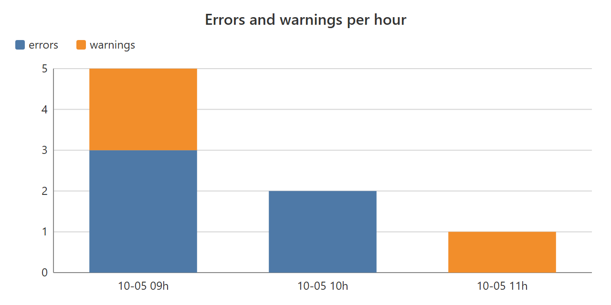

<!-- pagebreak -->

## M09 Log Detective

### The chore

Jonas's team runs a small import service that brings the orders of the
night into the sales system. When something goes wrong, someone opens
the log file, scrolls through two thousand lines, and tries to find out
whether last night was worse than usual. The answer is always the same
search for the word *ERROR*, a few minutes of counting, and a guess. The
pattern, such as the same timeout every morning at nine, is only seen
by whoever happens to look on three days in a row.

### What you get

Every weekday morning the Log Detective reads the log files of a folder
and answers three questions. How many errors and warnings were there?
In which hour did they pile up? Which error message comes back again
and again? It writes a short report and a chart of the hours:



The recipe reads any text log whose lines start with a date and a time,
which covers most programs that write logs: web servers, import jobs,
backup tools, and the recipes of this book.

### Before you start

Find the folder where the program you want to watch writes its logs,
and check that you may read it. The wizard asks for that folder and for
the pattern of the file names, such as `*.log`.

### The program

The program finds the files, hands each one to the module, and writes
the report and the chart:

<!-- include recipes/medium/M09_log_detective/log_detective.jdb -->

The module knows how to read a log line and keeps the counters:

<!-- include recipes/medium/M09_log_detective/logscan.jdb -->

### How it works

1. **The counters.** `NEW` creates one map that holds everything the
   recipe learns: a map of hours, each with its count of errors and
   warnings; a map of error messages with how often each came; and the
   number of lines read and skipped. Passing this one map around is
   simpler than passing five separate variables.

2. **Reading a line.** `PARSE` uses two regular expressions. The first,
   `gStamp$`, looks for a date and a time at the very start of the line
   and keeps the date and the hour in two groups. `REGEX.FINDALL`
   answers a list of matches, each a list of its groups, which is why the
   code reads `stamp[0][0]` for the date and `stamp[0][1]` for the hour.
   The second expression looks for a level word. Programs write levels
   in many ways (`WARN`, `WARNING`, `[warning]`, `FATAL:`), so the line is
   turned into capitals first, and `FATAL` and `WARNING` are mapped to
   the two levels the report knows.

3. **Lines that belong to the line before.** A stack trace or a long
   message continues on lines without a time stamp. `PARSE` answers an
   empty map for them, and `SCAN_TEXT` counts them as skipped. The report
   stays about events, not about lines.

4. **The same error, a different number.** "Timeout after 30 s on job
   4711" and "Timeout after 45 s on job 4720" are the same problem.
   `SIGNATURE$` replaces every number with `#`, so both become "Timeout
   after # s on job #" and are counted together. This one line of code
   is what turns a log into a list of problems.

5. **Putting it together.** `TOP_MESSAGES` sorts the error messages by
   their count with `GRADE`, as M12 does with meeting hours.
   `WORST_HOUR$` finds the hour with the most errors. `REPORT$` writes
   the text, and `CHART` draws the stacked bar chart with the SVG
   library: one bar per hour, the errors at the bottom and the warnings
   on top.

The chart is an SVG file, a drawing any web browser shows. Double-click
it, or put it on a page next to the report.

### Run it

With the example log of the recipe's folder:

```
jdbasic log_detective.jdb
1 files in C:/Logs/import
11 lines, 5 errors, 3 warnings
Most errors: 2026-10-05 09:00

Most frequent errors
    3  Timeout after # s on job #
    1  Cannot open file report_#.xlsx
    1  database connection lost

Per hour          errors  warnings
  2026-10-05 09:00      3         2
  2026-10-05 10:00      2         0
  2026-10-05 11:00      0         1
```

The last two lines name the text file and the chart. With `--dry-run`
the recipe prints the report and writes nothing.

### Schedule it

The wizard plans the Log Detective for weekdays at 7:45, so the report
of the night is waiting when the team starts.

### Make it yours

The settings are in the part of `work.conf` that starts with
`[log_detective]`:

```toml
[log_detective]
folder = "C:/Logs/import"
pattern = "*.log"
top = 5
out_folder = "~/Documents/AutomateWork/logs"
```

The interesting changes are in the code:

- **A different time stamp.** Some programs write `05.10.2026 09:14:03`
  or `[05/Oct/2026:09:14:03`. Change `gStamp$` at the top of the module.
  For the German form it becomes:

  ```basic
  DIM gStamp$ = "^([0-9]{2}\.[0-9]{2}\.[0-9]{4}) ([0-9]{2}):"
  ```

  The two groups still hold the day and the hour, so nothing else has to
  change.

- **More levels.** To count `CRITICAL` as an error, add it to `gLevel$`
  (`"\b(FATAL|CRITICAL|ERROR|WARNING|WARN)\b"`) and map it in `PARSE`
  with one more line: `IF word$ = "CRITICAL" THEN word$ = "ERROR"`.

- **Ignore a known message.** If a harmless error fills the report, skip
  it in `SCAN_TEXT` before it is counted:

  ```basic
  IF INSTR(p{"message"}, "heartbeat") >= 0 THEN CONTINUEFOR
  ```

- **Only the last day.** Logs that grow for weeks make the report long.
  Compare `p{"hour"}` with yesterday's date (from `FORMAT_DATE`) in
  `SCAN_TEXT` and count only matching lines.

### When it goes wrong

- **"0 errors" although you see errors**: the time stamp has a form
  `gStamp$` does not know, so every line is skipped. The report shows
  the number of lines; compare it with what you expect, and adapt the
  expression as shown above.
- **The file is in use**: some programs keep their log open. Reading it
  usually works anyway. If not, point the recipe at the rotated files of
  the days before (`app.log.1`, `app-2026-10-04.log`) with the pattern.
- **Very large logs take long**: the recipe reads each file whole. For
  logs of many megabytes, schedule it at night and keep only the files
  of the last days in the folder.

> **Balance dividend**
> About 30 minutes a week of scrolling through logs, and problems seen
> on the first morning instead of the third.
