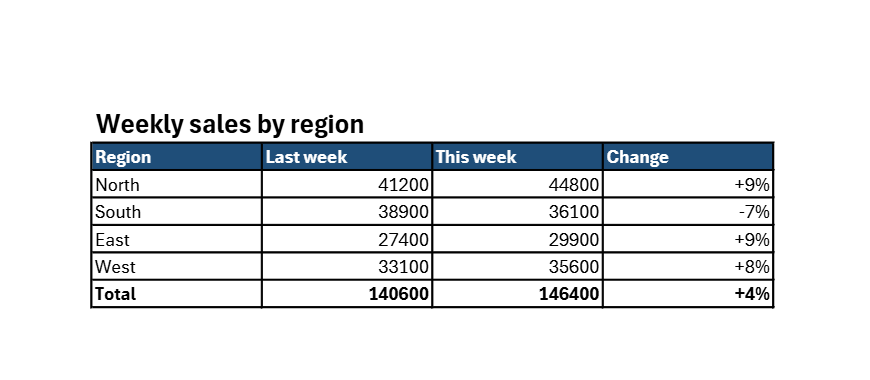

<!-- pagebreak -->

## Bonus: M18 Excel Refresh

### The chore

Every Monday Jonas sends the weekly sales report to his department.
The workbook is built: its data comes from the sales database through
a connection, pivot tables and formulas do the rest. Still he opens
it, clicks *Refresh All*, waits, checks that the numbers moved, saves
it, makes a PDF of the summary sheet and writes the mail. Twenty
minutes on a good Monday, and on a busy one the report goes out at
noon.

### What you get

Early on Monday morning Excel Refresh opens the report in Excel,
refreshes its connections and pivot tables, recalculates and saves
it. Then it makes a PDF of each sheet you chose, with the date in its
name, and puts a mail with the PDFs into your outbox. Everything Excel
draws stays as it is: formulas, formats, charts and conditional
colours, because Excel itself does the work.



### Before you start

The setup wizard has run, and you have a report workbook that gets
its data by itself when you click *Refresh All*: from a database,
another workbook, a CSV file or a web page. Write down the names of
the sheets that belong in the PDF.

> **Watch out**
> The recipe needs Excel installed and licensed on this computer, the
> desktop version of Microsoft Office. It runs under your own account,
> so it reaches the data sources with your rights, and it runs from
> the Task Scheduler while you are logged in, not as a Windows
> service. A connection that asks for a password each time stops the
> refresh; store the password in the connection or ask IT for a
> connection that uses your Windows login.

### The program

The program reads the settings, lets the module do the Excel part and
puts the mail into the outbox:

<!-- include recipes/medium/M18_excel_refresh/excel_refresh.jdb -->

The module talks to Excel and writes the mail:

<!-- include recipes/medium/M18_excel_refresh/refresh.jdb -->

### How it works

1. `REFRESH.RUN` starts Excel with `CREATEOBJECT` and switches off its
   window and its questions. It opens the workbook for writing.
2. `RefreshAll` asks every connection and pivot table for new data,
   and `CalculateUntilAsyncQueriesDone` waits until the last one has
   answered. `CalculateFull` recalculates every formula, and `Save`
   writes the workbook back, so the next person who opens it sees the
   new numbers.
3. The names of the sheets go through `REFRESH.CHOOSE`, which finds
   the ones you listed, no matter how you wrote upper and lower
   case, and names the ones the workbook does not have.
4. Each chosen sheet becomes a PDF through `ExportAsFixedFormat`, as
   `weekly sales Summary 2026-10-05.pdf`: the workbook, the sheet and
   the day, so last week's PDF is never overwritten.
5. At the end, and also when something fails, the workbook is closed,
   Excel quits and every object is let go with `RELEASEOBJECT`. An
   error names the workbook and what Excel said.
6. With `mail_to` set, `REFRESH.MESSAGE` builds the mail with the PDFs
   attached and `OUTBOX.PUT$` puts it into the outbox. It goes out
   with `--send`, as every mail of the book does.

### Run it

See what would happen first:

```
jdbasic excel_refresh.jdb --dry-run
would refresh, recalculate and save C:/Reports/weekly sales.xlsx
would make PDFs of Summary
  in C:/Reports/pdf
would put a mail to sales-team@example.com
```

Then without `--dry-run`. A refresh takes as long as it takes in
Excel by hand; the program waits for it and prints the PDFs it made.
Open the outbox to read the mail, and send it with `--send`.

### Schedule it

The wizard plans it weekly on Monday at seven, before most people
read their mail. A report that changes daily can run on weekdays.

### Make it yours

The settings are the `[excel_refresh]` part of `work.conf`:

```toml
[excel_refresh]
workbook = "C:/Reports/weekly sales.xlsx"
sheets = ["Summary"]
pdf_folder = "~/Documents/AutomateWork/reports"
mail_to = "sales-team@example.com"
```

- **Every sheet.** Leave `sheets` empty, `[]`, and each sheet of the
  workbook becomes a PDF.
- **No mail.** Leave `mail_to` empty when the PDFs go to a shared
  folder instead; set `pdf_folder` to that folder.
- **Several reports.** Copy the recipe folder once per workbook, give
  each copy its own part in `work.conf` by changing `key$` in the
  program, and plan each at its own time.

### When it goes wrong

- **"No workbook at ..."**: the path in `workbook` is wrong, or the
  drive is not connected at that hour. Check it in the Explorer.
- **"no sheet named Summery"**: a typing mistake in `sheets`. The
  other sheets are still made into PDFs.
- **"Excel Refresh stopped: weekly sales.xlsx: ..."**: Excel could not
  open, refresh or save the workbook. Most often it is open on another
  computer and locked, or a data source did not answer. Open it by
  hand and click *Refresh All* to see Excel's own message.
- **The PDF shows the old numbers**: the connection is set to refresh
  in the background only when the file opens. In Excel, under *Data,
  Queries and Connections, Properties*, tick *Refresh data when
  refreshing all*.

> **Balance dividend**
> About 30 minutes a week for anyone who sends a regular report, and
> a report that is in the mailboxes before the Monday meeting.
