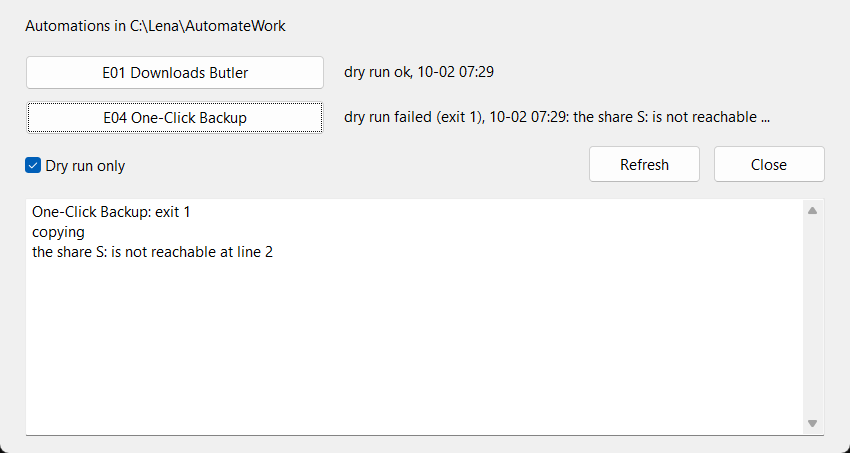

<!-- pagebreak -->

## X06 Work Cockpit

### The chore

Lena's automations run in the background, and that is the point. Now
and then she wants one of them right away: the backup before she
leaves for a week, the downloads tidied before a screen share, the
status mail a day early. Each time she opens a command prompt, finds
the folder, remembers the name of the program and whether it takes
`--dry-run`. And when a colleague asks whether last night's backup
went through, she opens a log file and searches. It is a few minutes
each time, several times a week, and it is the part of her
automations her colleagues never see.

### What you get

A window with one button per automation in your work folder. Next to
each button it shows when the automation ran last from this window
and how it ended. A click starts it, as a dry run when the box is
ticked, and the output appears at the bottom.



Every start lands in `logs/cockpit.log` of the work folder, with the
time, the automation, the kind of run, the exit code and the last line
of the output.

### Before you start

The recipes must be installed by the wizard, so that each has its
folder with a `recipe.toml` under `recipes` in your work folder. The
cockpit needs the forms release of jdBasic, the one the wizard needs.
Nothing else: it reads the work folder and the jdbasic program from
the `[paths]` part of `work.conf`.

### The program

The program builds the window, with one button and one label per
automation, and handles the clicks:

<!-- include recipes/expert/X06_work_cockpit/work_cockpit.jdb -->

The module finds the automations, starts them, and reads and writes
the log:

<!-- include recipes/expert/X06_work_cockpit/cockpit.jdb -->

### How it works

1. **Finding the automations.** `INSTALLED` looks at each folder
   under `recipes` in the work folder and reads its `recipe.toml`. The
   id, the name and the program are all the cockpit needs. The
   cockpit's own folder, id `X06`, is left out, so it does not offer a
   button that opens a second cockpit.

2. **A button per automation.** The program creates the buttons in a
   loop and names them `btnRun0`, `btnRun1` and so on. A form calls
   a handler named after the control, such as `BTNRUN0_CLICK`, and
   `ON handler$ CALL RunClick` sends all of them to one handler. The
   event tells `RunClick` the name of the button that was clicked,
   and the number at its end is the place of the automation in the
   list.

3. **Starting an automation.** `RUN` starts jdbasic with the program,
   `--config` and the settings file, and `--dry-run` when the box is
   ticked. It waits until the program ends and keeps its exit code and
   output. With `tries` above 1, a run that fails is started again a
   second later, for automations that depend on a network drive that
   is not always there at once.

4. **The log.** `LOG_LINE$` writes one line per start, the fields
   separated by tabs, so a message with a comma or a semicolon stays
   in one field. `APPEND_LOG` adds the line at the end of the file. If
   another program holds the file open at that moment, it tries again
   three times before it gives up with an error.

5. **The state next to each button.** `READ_LOG` reads the log back
   as rows, and `LAST` finds the last row of each automation. `STATUS$`
   turns it into words such as *dry run ok, 10-05 08:31* or *failed
   (exit 1), 10-05 09:15: the share S: is not reachable*, cut to fit
   the label. `CLEAN$` takes the colour codes out of the output, which
   jdBasic puts around its error messages for the console.

6. **The self test.** With `--selftest` the cockpit creates a made-up
   work folder with two automations, a Downloads Butler that answers a
   dry run and a backup that always fails, and drives its own window
   with a timer. It ticks the box, clicks both buttons by setting their
   `VALUE`, checks the labels and the log, and closes. No mouse and no
   keyboard are involved, so the test runs while you work.

### Run it

Start the cockpit:

```
jdbasic work_cockpit.jdb
```

Tick *Dry run only* and click a button to see what an automation
would do. Untick it to run it for real. *Refresh* reads the log again,
which shows runs of other cockpit windows too.

The self test needs the jdbasic program, since it starts the made-up
automations with it:

```
jdbasic work_cockpit.jdb --selftest --jdbasic C:/jdBasic/jdbasic.exe
ALL COCKPIT WINDOW TESTS PASSED
```

### Schedule it

The cockpit is a window for a person, so it is not scheduled. To have
it open every morning, set its schedule in the wizard to `at logon`.
The automations themselves keep their own schedules, from the wizard
or from the job server of X01; the cockpit is for the runs in between.

### Make it yours

The setting is in the part of `work.conf` that starts with
`[work_cockpit]`:

```toml
[work_cockpit]
tries = 1
```

- **More automations.** The window shows up to twelve. For more, raise
  the 12 in the line that sets `gShown`; the window grows by 36 pixels
  per row.
- **Only some of them.** To hide automations, filter the list after
  `INSTALLED`, for example only the ones whose id starts with `E` or
  `M`:

  ```basic
  gList = FILTER(LAMBDA e -> LEFT$(e{"id"}, 1) <> "X", gList)
  ```

- **Show the log.** Add a button that puts the last 20 lines of the
  log into the output box:

  ```basic
  SUB BTNLOG_CLICK(e)
      IF NOT FILE.EXISTS(gLog$) THEN RETURN
      DIM t$ = TRIM$(REPLACE$(TXTREADER$(gLog$), CHR$(13), ""))
      DIM tail = TAKE(-20, SPLIT(t$, LF$))
      FORM.SET(txtOut, "TEXT", JOIN(tail, CHR$(13) + LF$))
  ENDSUB
  ```

  and create the button next to *Refresh*:

  ```basic
  DIM btnLog = FORM.BUTTON(frm, "btnLog", "Log", 370, top + 4, 90, 30)
  ```

### When it goes wrong

- **No buttons, "Nothing installed."**: the work folder in `[paths]`
  is not the one the wizard used, or no recipe is installed yet. The
  first line of the window shows the folder the cockpit looks at.
- **Every run fails at once with exit 1**: the jdbasic program in
  `[paths]` is wrong or moved. The output box shows what Windows said,
  such as *The system cannot find the path specified*.
- **The window freezes for a while**: a run is in progress. The
  cockpit waits for the automation to end; long ones, such as a
  backup, keep the window busy until they are done.

> **Balance dividend**
> About 20 minutes a week of looking for folders, programs and log
> files, and an answer to *did the backup run?* in one glance.
