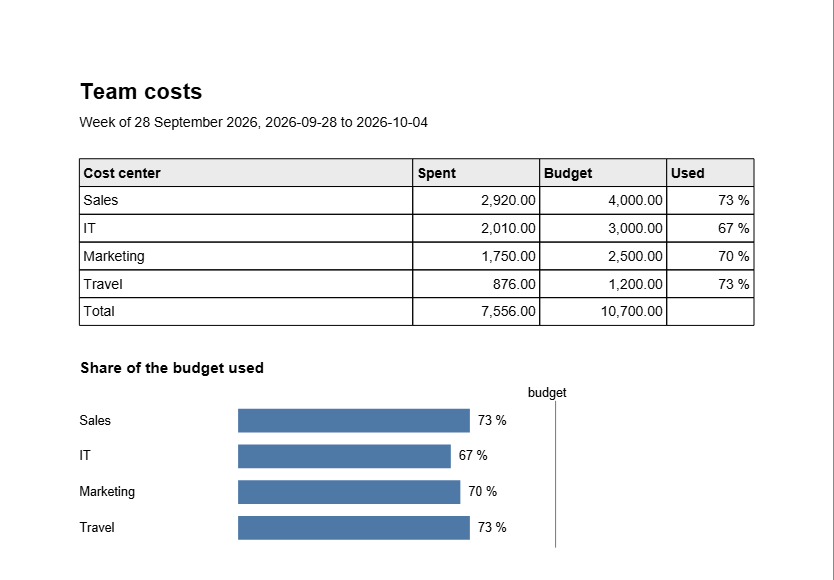

<!-- pagebreak -->

## X09 Report Pipeline

### The chore

Every Monday at nine the head of Lena's department wants to know what
the team spent last week, per cost center, against the budget. The
numbers are in the bookings database that the finance system fills
every night. Lena opens it in Excel, filters the week, builds a pivot
table, copies it into last week's Word file, draws the bars for the
share of the budget by hand, saves a PDF and writes the mail. On a good
Monday that is 45 minutes before her own work starts. On a bad one the
export is still running at eight, the numbers are from Saturday, and
nobody notices until the meeting.

### What you get

Every Monday at seven the pipeline reads last week's bookings from the
database and writes three files:

- a chart of spent and budget per cost center as SVG, the picture
  format every browser and the intranet show,
- a Word file with the table and a list of the cost centers over
  budget, for anyone who wants to add a comment,
- a PDF page with the table and a bar per cost center that shows how
  much of its budget is used, red when it is over.

It puts the mail with the PDF and the Word file attached into the
outbox, and every step leaves a line in a log.



### Before you start

The recipe reads a SQLite database, the kind of single file database
many programs use to keep their data, with two tables:

| Table | Columns |
|---|---|
| `bookings` | `day` (YYYY-MM-DD), `cost_center`, `amount` |
| `budgets` | `cost_center`, `week_budget` |

If your finance system exports a CSV file instead, the Hot Folder of
M10 or a short loop with `DB.INSERTMANY` fills the table; the section
*Make it yours* shows the lines. To try the pipeline before you have a
database, let it write a sample with eight weeks of bookings:

```
jdbasic report_pipeline.jdb --sample
```

The recipe's part of `work.conf` names the database, the folder for
the reports and who gets the mail:

```toml
[report_pipeline]
database = "~/Documents/AutomateWork/reports/bookings.db"
folder = "~/Documents/AutomateWork/reports"
to = "Paul Berger <paul.berger@example.com>"
```

### The program

The program is a pipeline in the plain sense: each step takes what the
step before handed it. It reads the settings, finds the week, reads
the database, makes the report and writes it out:

<!-- include recipes/expert/X09_report_pipeline/report_pipeline.jdb -->

The module holds every step as a function of its own:

<!-- include recipes/expert/X09_report_pipeline/pipeline.jdb -->

### How it works

1. **The week.** `LAST_WEEK` goes back to the Monday of the week the
   day is in, and seven days more. A run on Monday 5 October reports
   28 September to 4 October, and so does a run on the Thursday after,
   when you start it by hand.
2. **Counting days from noon.** `DATEADD` counts a day as 24 hours,
   but the day the clocks change has 23 or 25. Seven days back from
   midnight can then land at eleven in the evening of the day before,
   and the report would start on a Sunday. From noon, an hour more or
   less never changes the date. The test runner of X12 found this
   mistake in an earlier version of this recipe; that recipe shows the
   check that caught it.
3. **The database.** `BOOKINGS` opens the database through `RETRY.RUN`.
   When the file is not there yet, because the nightly export writes
   it last, the first attempt fails, and the pipeline waits a quarter
   of a second, then half a second, then a second, before it gives
   up. The query is built with
   `DB.WHERE` and question marks; the dates are filled in as values,
   so no text from outside ever becomes part of the SQL.
4. **The data frame.** `REPORT` puts the rows into a frame with
   `DF.FROMROWS` and adds them up per cost center with `DF.GROUPBY`.
   A cost center with a budget and no bookings in the week still gets
   a row with 0, so the report always has the same lines.
5. **Text for people.** `MONEY$` writes amounts with two decimals and a
   comma every three digits. `TABLE_ROWS` turns the frame into rows of
   text with a total at the end, and every output uses those same
   rows, so the Word file, the PDF and the mail never disagree.
6. **The chart.** `CHART$` draws spent and budget side by side with
   `SVG.CHART`. The PDF draws its own bars with `PDFGEN.BOX`, because a
   PDF page takes pictures, not SVG markup.
7. **The log.** `LOGGER.TO_FILE` writes one line per step into
   `report_pipeline.log` in the reports folder, and keeps three old
   files when it grows past a megabyte. When the database cannot be
   read, the error goes into the log before the program stops, so the
   log says why there was no report.

### Run it

```
jdbasic report_pipeline.jdb --dry-run
Week of 28 September 2026: 20 bookings
  Sales: 2,920.00 of 4,000.00
  IT: 2,010.00 of 3,000.00
  Marketing: 1,750.00 of 2,500.00
  Travel: 876.00 of 1,200.00
  Total: 7,556.00 of 10,700.00
would write C:\Users\lena\Documents\AutomateWork\reports\
            costs 2026-09-28.svg, .docx and .pdf
would put a mail to Paul Berger <paul.berger@example.com>

jdbasic report_pipeline.jdb
Wrote C:\Users\lena\Documents\AutomateWork\reports\
      costs 2026-09-28.svg, .docx and .pdf
In the outbox: C:\Users\lena\Documents\AutomateWork\outbox\
               costs 2026-09-28.eml
```

The log of that morning, with its long lines wrapped:

```
2026-10-05 07:00:02 INFO  [report_pipeline] report started
    from=2026-09-28
2026-10-05 07:00:03 INFO  [report_pipeline] report written
    base="C:/Users/lena/Documents/AutomateWork/reports\costs
    2026-09-28" over=0
2026-10-05 07:00:03 INFO  [report_pipeline] mail in the outbox
    path="C:/Users/lena/Documents/AutomateWork/outbox\costs
    2026-09-28.eml"
```

`--day 2026-10-12` writes the report as if it were that day, which is
how you write a week again after finance corrected a booking.

### Schedule it

The wizard plans the recipe for Monday at 07:00, every week. If the X01
job server runs your jobs, give the pipeline a job there instead. The
server runs its jobs one after another, so the report never starts
while a nightly import of the same server still writes, and with
`attempts` it tries again ten minutes later when the database is
missing:

```toml
[[job]]
name = "Monday report"
when = "weekly mon 07:00"
program = "X09_report_pipeline/report_pipeline.jdb"
attempts = 3
retry_seconds = 600
```

The mail waits in the outbox. Look at the PDF, then send it with
`jdbasic report_pipeline.jdb --send`. Once the reports have been right
for a month, you can let the job server send them too.

### Make it yours

- **More than one week.** For a month instead of a week, give
  `LAST_WEEK` a sister that answers the first and the last day of the
  month before, and use it in the program instead. Everything after
  it works on any range.
- **More readers.** `to` takes several addresses, separated by commas:

  ```toml
  to = "Paul Berger <paul.berger@example.com>, team@example.com"
  ```

- **Filling the database from a CSV export.** A few lines read the
  export and append it, here for a file with the columns day, cost
  center and amount:

  ```basic
  DIM rows = CSVREADER("export.csv", ";", TRUE)
  DIM h = DB.OPEN(db$)
  DIM n = DB.INSERTMANY(h, "bookings", _
      ["day", "cost_center", "amount"], rows)
  DB.CLOSE(h)
  ```

- **A warning line of your own.** `OVER_BUDGET` lists cost centers
  above 100 percent. To hear about them a little earlier, compare with
  `90` instead and change the words in `OverLine$` to *close to its
  budget*.

### When it goes wrong

- **"No database at"**: the path in `database` is wrong, or the export
  has not created the file yet. Run with `--sample` once to see where
  the pipeline looks.
- **"database is locked"**: the pipeline ran while the export was
  still writing. Start it later, or let the X01 job server run both,
  one after the other.
- **All amounts are 0**: the dates in the database have another form,
  such as `05.10.2026`. The query compares text, so `day` must be
  written `YYYY-MM-DD`.
- **The report starts on a Sunday**: you changed `LAST_WEEK` and lost
  the noon. Run the tests of X12; they say so within a second.

> **Balance dividend**
> About 60 minutes a week: 45 on Monday morning, and the quarter of an
> hour it takes to find out why last week's numbers looked wrong.
