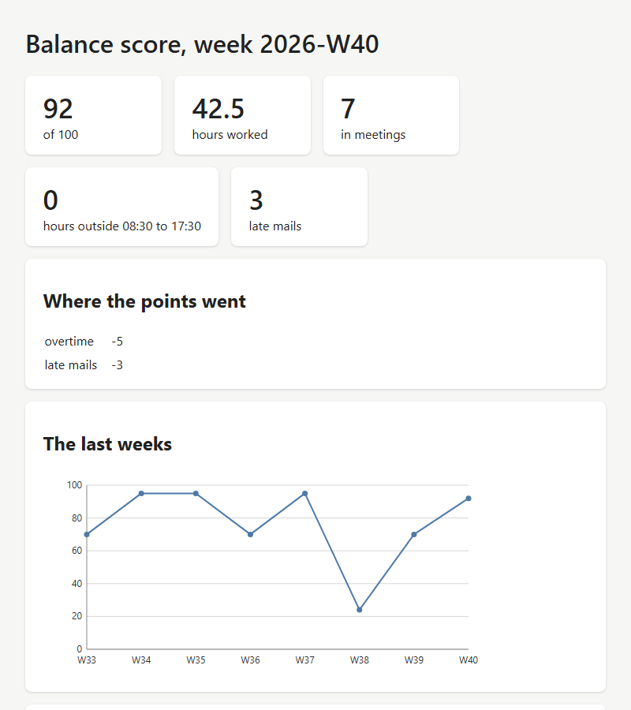

<!-- pagebreak -->

## X15 Balance Score

### The chore

This book began with a question: where does your week go? Lena has an
answer for every single part of it. The Time Tracker knows her hours,
the calendar knows her meetings, the outbox knows when she wrote her
mails. What she does not have is the picture of all three together,
and how it changes. A week with 48 hours does not feel like one while
she is in it; she notices in the third such week, when it is late.

### What you get

A page on your own computer with one number for the week, from 0 to
100, and where the points went:

- **hours** above a normal week,
- **meetings** above a share of the week that is still fine,
- **work outside your working hours**, in the evening, early in the
  morning and at the weekend,
- **mails written at those times.**

Below it is the trend of the last eight weeks, and at the bottom the
rules that make the score, with the weights of your `work.conf` filled
in. Nothing on the page is hidden: you can recount every point.



### Before you start

The score is only as good as its sources:

- the **Time Tracker (E07)** has been running for a few weeks; the
  recipe finds its log through the `folder` of `[time_tracker]`, as
  M15 does,
- your **calendar** as an `.ics` file. Outlook and Google export one;
  in Outlook choose *File*, *Save Calendar*, and save it as
  `calendar.ics` in your work folder,
- the **outbox** of the mail rule of Chapter 4, with its `sent`
  folder.

Your working hours are the `day_start` and `day_end` of the `[user]`
part, the ones the wizard asked for. The recipe's own part holds the
calendar and the weights:

```toml
[balance_score]
calendar = "~/Documents/AutomateWork/calendar.ics"
target_hours = 40
meeting_share = 40
weight_overtime = 2
weight_meetings = 1
weight_late = 3
weight_mail = 1
```

### The program

The program reads the settings and either prints the scores, writes
the page once, or serves it:

<!-- include recipes/expert/X15_balance_score/balance_score.jdb -->

The module collects the numbers, makes the score and builds the page:

<!-- include recipes/expert/X15_balance_score/balance.jdb -->

The page is a template in `templates/balance.html`, so you can change
its look without touching the code. This is the part that explains
the score; `TMPL.RENDER$` fills in the parts in double braces:

<!-- include recipes/expert/X15_balance_score/templates/balance.html lines=45-60 -->

### How it works

1. **Instants instead of dates.** The module counts in DT instants,
   seconds since 1970 in UTC, and turns them into a wall clock with
   the offset of your time zone. An hour is always 3600 seconds, and
   no change of the clocks shifts a date.
2. **Weeks.** `WEEK$` names the ISO week of an instant, such as
   `2026-W41`. The week starts on Monday, the way most calendars in
   Europe count it.
3. **Working hours.** `OUTSIDE` says whether an instant falls on a
   weekend or before `day_start` or after `day_end`, both in minutes
   after midnight from `MINUTES`.
4. **The time log.** `ADD_LOG` reads the log of E07 and walks through
   every block of work in steps of a quarter of an hour. Each step
   adds a quarter to the hours of its week, and to the late hours if
   it is outside. A block that runs over midnight or over the end of a
   week is split on its own.
5. **Totals.** The numbers go into one map under keys such as
   `2026-W41|hours`. `WEEK_OF` collects the numbers of one week from
   it, with 0 for anything that has not happened.
6. **Meetings and mails.** `ADD_MEETINGS` expands the calendar with
   `ICAL.EXPAND`, so a weekly meeting counts every week, and leaves out
   all-day events such as holidays. `ADD_MAILS` counts the `.eml` files
   of the outbox and of `sent` at the time of their file.
7. **The score.** `SCORE` starts at 100 and takes away the points of
   each rule that applies, and it keeps the reasons, so the page can
   show them. The score never goes below 0.
8. **The page.** `PAGE$` fills the template with this week's numbers,
   the reasons, the chart of `CHART$` and the rules. `MOUNT` puts the
   page at `/` and the numbers as JSON at `/data.json`, and every
   request counts again, so a refresh shows the minute you are in.

### Run it

```
jdbasic balance_score.jdb --print
2026-W33   70  48.5 hours
2026-W34   95  42.5 hours
2026-W35   95  42.5 hours
2026-W36   70  48.5 hours
2026-W37   95  42.5 hours
2026-W38   24  57.5 hours
2026-W39   70  48.5 hours
2026-W40   92  42.5 hours

jdbasic balance_score.jdb
Your balance score: http://localhost:8766/
Only this computer can open it. Stop it with Ctrl+C.
```

Open the address in your browser. `--save week.html` writes the page
once into a file, for a week you want to keep or show.

### Schedule it

The wizard starts the page when you log on, like the dashboard of M08.
It costs nothing while nobody looks at it. Leave it out of the X01 job
server: a job server runs jobs that end, and this one serves until you
stop it.

### Make it yours

- **Your own weights.** The weights are settings. If evenings hurt you
  more than long weeks, raise `weight_late` and lower
  `weight_overtime`. Change them for a month before you trust the
  number; the trend shows whether the score agrees with how the weeks
  felt.
- **A part-time week.** Set `target_hours` to the hours of your
  contract, `24` for three days a week.
- **A rule of your own.** Each rule is four lines in `SCORE`. This one
  costs a point for every meeting hour above ten a week:

  ```basic
  DIM much = w{"meeting_hours"} - 10
  IF much > 0 THEN PUSH(parts, ["too many meetings", much])
  ```

  Add a line to the template that explains it, so the page stays
  honest.
- **More weeks.** `weeks = 12` in `[balance_score]` shows a quarter of a
  year.

### When it goes wrong

- **The score is 100 every week**: the recipe finds no log. Check the
  `folder` of `[time_tracker]`, and that `log.csv` in it has lines.
- **No meetings**: the calendar file is old or not where `calendar`
  says. Export it again; the recipe reads the file, not your mail
  program.
- **Hours shifted by one**: the recipe uses the offset of your time
  zone today for all weeks, so a log line from before a change of the
  clocks is read one hour off. Up to an hour of such a week can move
  across the edge of your working hours. The weeks before the change
  look a little better or worse than they were.
- **"Port 8766 is taken"**: another program uses the port. Set `port`
  in `[balance_score]` to another number above 1024.

> **Balance dividend**
> About 15 minutes a week, for the look at the numbers you would
> otherwise put together by hand. The real dividend is the week you
> notice in time.
