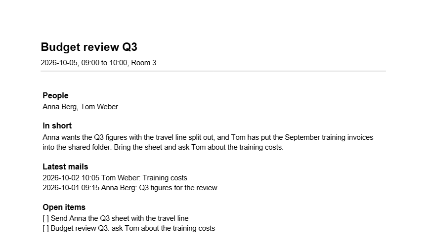

<!-- pagebreak -->

## Bonus: X17 Meeting Briefing

### The chore

Lena has four to six meetings a day. Before each one she opens the
invitation to see who comes, searches her mail for what these people
wrote last, scrolls through her notes for what she promised them, and
tries to remember what the meeting was for. Five minutes per meeting
on a good day, and on a bad day she walks in without having done it
and spends the first ten minutes catching up.

### What you get

Every morning at half past seven a PDF waits in your work folder with
one page per meeting of the day: the time and the room, the people,
the latest mails with them, your open items that name them, and a few
sentences written by a language model that sum up what the meeting is
about and what the others are waiting for.



### Before you start

The recipe reads three things you probably have already:

- **Your calendar as an `.ics` file.** Outlook exports one under
  *File, Save Calendar*; many calendar services offer a private
  address of the calendar in this format. The Calendar Bridge of X05
  writes one as well.
- **Your saved mails** as `.eml` files, the folder the Inbox Assistant
  (X02) reads, and the `outbox/sent` folder of Chapter 4.
- **Your notes file** with open items as `- [ ]` lines, the one the
  Personal Dashboard (M08) reads.

For the summary you need a language model, as for X02: a key in
`OPENAI_API_KEY` or `ANTHROPIC_API_KEY`, or a model server on your own
computer such as Ollama, named in `base_url`. Without either, the
briefing is written as well, only without the sentences on top. The
recipe never asks for a key, because it runs at half past seven when
nobody is there to type one.

> **Watch out**
> The summary means that the mails and notes of a meeting go to the
> language model. A mail you hand to a service goes to that service.
> Before you use a service for work mail, ask whether your company
> allows it. Mails with personal data or business secrets are a reason
> to use a model on your own computer, or to switch the summary off
> with `use_model = false`.

### The program

The program reads the settings, finds the day's meetings and builds
one page per meeting:

<!-- include recipes/expert/X17_meeting_briefing/meeting_briefing.jdb -->

The module does the work, from the calendar to the PDF:

<!-- include recipes/expert/X17_meeting_briefing/briefing.jdb -->

### How it works

1. `MEETINGS` reads the calendar with the ICAL library and asks it for
   every event between the day before and the day after, repeating
   meetings included. It keeps those that start on the day you asked
   for and leaves out events that block whole days, such as a holiday.
2. A time in the calendar can carry a time zone or not. A time with a
   zone is shown on your computer's clock; a time without one is shown
   as the file writes it, which is what Outlook means by it. That is
   the work of `Zoned`.
3. `NAMES` reads the names of the people from the `CN` part of the
   `ATTENDEE` lines, so the page says "Anna Berg" and not her address.
4. `MAILS` reads every saved mail and keeps those from or to one of
   the people, newest first. `SORTDATE$` turns the date line of a mail
   into a text that sorts.
5. `ITEMS` keeps the open items of your notes that name the meeting or
   the first name of one of its people.
6. `PROMPT$` writes all of it into one text, and `SUMMARY$` sends it to
   the language model with the rules of `RULES$`: four sentences at
   most, nothing that is not in the text. A busy server is asked again
   up to three times; a refused key stops at once.
7. `WRITE_PDF` sets one page per meeting with PDFGEN. A meeting whose
   summary failed gets its page anyway, and the log says why.

### Run it

Look at the day first. The dry run asks no model and writes nothing:

```
jdbasic meeting_briefing.jdb --day 2026-10-05 --dry-run
09:00-10:00  Budget review Q3  (2 people, 2 mails, 2 open items)
14:00-14:30  Supplier call Miller Ltd  (1 person, 1 mail, 1 open item)
2 meeting(s); nothing written
```

Then for real, here with `folder` set to `C:/Users/lena/Briefings`:

```
jdbasic meeting_briefing.jdb
09:00  Budget review Q3
14:00  Supplier call Miller Ltd
wrote C:/Users/lena/Briefings\briefing 2026-10-05.pdf
```

`--no-model` writes the briefing without the summaries, for a day when
you would rather not send anything anywhere.

### Schedule it

The wizard plans the recipe for weekdays at 07:30, before the first
meeting. Under the job server of X01 it is one more block in
`jobs.toml`, with `catch_up = true`: a briefing written at nine for a
computer that was off at half past seven is still useful.

With `mail_to_self = true` the briefing also goes into the outbox as a
mail to yourself, with the PDF attached. Send it with `--send` when
you want the briefing on your phone, or open the PDF straight from
the work folder.

### Make it yours

The settings are the `[meeting_briefing]` part of `work.conf`:

```toml
[meeting_briefing]
calendar = "~/Documents/AutomateWork/calendar.ics"
mail_folders = ["~/Documents/AutomateWork/saved mail"]
notes = "~/Documents/AutomateWork/todo.txt"
folder = "~/Documents/AutomateWork/briefings"
mails_per_meeting = 3
use_model = true
provider = "openai"
model = "gpt-4o-mini"
base_url = ""
mail_to_self = false
```

- **More history.** `mails_per_meeting = 6` shows more of the
  conversation; the model reads them all.
- **Your own rules.** Change `RULES$` in the module to ask the model
  for what you need, such as "end with one question I should ask".
- **Only some meetings.** Skip meetings whose title starts with
  "Blocker" or "Lunch" with one line in the loop of `MEETINGS`:
  `IF STARTSWITH(r{"summary"}, "Lunch") THEN today = FALSE`.
- **A local model.** `base_url = "http://localhost:11434/v1"` and
  `model = "llama3.1"` keep every mail on your computer.

### When it goes wrong

- **"No calendar file at"**: the export did not happen or went
  somewhere else. Export it again, or point `calendar` at it.
- **"No meetings on 2026-10-05"** although there are some: the export
  covers a range of days; check that it reaches today.
- **The times are an hour off**: the calendar writes times without a
  zone, and the program that wrote it meant another zone than yours.
  Export the calendar with time zones; Outlook and most calendar
  services write them.
- **"no summary, ..."** in the output: the model did not answer. The
  log in `logs/meeting_briefing.log` has the message; the page of that
  meeting has no summary but everything else.

> **Balance dividend**
> About 45 minutes a week: five minutes of searching before each of
> nine meetings, now a glance at one page.
