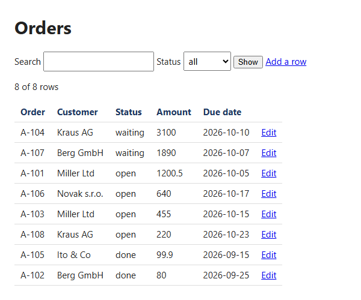

<!-- pagebreak -->

## Bonus: X18 Spreadsheet to Web App

### The chore

The team's open orders live in an Excel workbook on a shared drive.
Five people update it, and twice a month someone's change is gone
because two of them had the file open at the same time. Somebody
types "Done" instead of "done", a date as 5.10. instead of a date,
and the filters in the sheet stop working. Lena has asked IT for a
small tool for months; the request is still in the queue.

### What you get

The workbook becomes a small app in the browser. A list with a search
box, a filter for every column that holds a few fixed values, and
sorting by a click on a column head. A form to change a row or add
one, with a date field for dates, a number field for numbers and a
list for the fixed values, so a typing mistake cannot get in. Every
save goes back into the same workbook, after a copy of the version
before, and every change leaves a line in a log.



### Before you start

Any workbook works whose sheet has the column names in its first row.
The app guesses what each column holds:

| A column of | Becomes |
|---|---|
| numbers | a number field |
| dates, or day numbers under a head with "date" or "due" | a date field |
| a few values that repeat, such as open, done, waiting | a list and a filter |
| anything else | a text field |

Columns the app must not change, such as an order number, go into the
`read_only` setting; the form shows them but keeps them as they are.

> **Watch out**
> The app writes the sheet back with its values. Formulas, colours and
> column widths of that sheet are not kept, and a formula arrives as
> the value it last showed. Other sheets of the workbook are written
> back as values too. Use the app for a workbook that is a table of
> data, and keep the one with the formulas as it is. The app listens
> only on this computer, so a colleague cannot open it from theirs;
> X07 shows how to give them a copy of their own.

### The program

The program reads the settings, opens the sheet and starts the server:

<!-- include recipes/expert/X18_sheet_app/sheet_app.jdb -->

The module holds the table, builds the pages and saves the changes:

<!-- include recipes/expert/X18_sheet_app/sheetapp.jdb -->

### How it works

1. `OPEN` reads the workbook with XLSX and keeps the chosen sheet as
   column names and rows. `KIND$` looks at each column's values and
   decides what the column holds.
2. Excel stores a date as a day number, counted from the last day of
   1899. `SERIAL_DATE$` turns it into a date for the page and
   `DATE_SERIAL` back into a day number for the workbook, so Excel
   still shows a date after the app saved it.
3. `VIEW` answers the row numbers to show. `FILTER` keeps those that
   hold the search text and pass the filters, and `SORT` orders them
   by the key `SortKey$` builds from the column you clicked. Numbers
   sort as numbers, so 1890 comes after 455.
4. `LIST_HTML$` and `FORM_HTML$` build the pages. Every text goes
   through `ESC$`, so a customer called "Ito & Co" stays a name and
   never becomes part of the page's code.
5. Every row has a version number. The form sends the version it
   showed, and `APPLY$` refuses a save when the row has changed since,
   because someone else saved it in another browser tab. That is the
   lock that keeps two people from overwriting each other.
6. `CHECK$` refuses a word in a number field, a date in another form
   and a value that is not one of a column's fixed values. The form
   comes back with the message and what you typed.
7. `SAVE$` first checks that nobody changed the workbook on disk since
   the app read it, copies it into the backups folder, and writes all
   sheets back. `Note` writes one log line per change, such as
   `row 4: Status: open -> done`.

### Run it

Look at the columns first:

```
jdbasic sheet_app.jdb --dry-run
Order (text), read only
Customer (text)
Status (choice)
Amount (number)
Due date (date)
8 rows in C:/Users/lena/Documents/AutomateWork/orders.xlsx
```

Then start it and open the address in your browser:

```
jdbasic sheet_app.jdb
The app: http://localhost:8770/   (Ctrl+C stops it)
```

The app runs until you close its window or press Ctrl+C. While it
runs, change the workbook only through the app; the app refuses to
save over a workbook someone changed in Excel and asks you to restart
it.

### Schedule it

The wizard sets the recipe to *by hand*: you start the app when you
need it. To have it ready whenever you log on, give its `recipe.toml`
a second task, as the search page of X03 does:

```toml
[[task]]
name = "app"
schedule = "at logon"
args = []
```

### Make it yours

The settings are the `[sheet_app]` part of `work.conf`:

```toml
[sheet_app]
workbook = "~/Documents/AutomateWork/orders.xlsx"
sheet = ""
port = 8770
read_only = ["Order"]
backups = "~/Documents/AutomateWork/backups"
```

- **Another sheet.** `sheet = "Customers"` serves that sheet instead of
  the first one.
- **More fixed values.** `KIND$` treats a column with up to six values
  as a list when it has about twice as many rows as values. For a
  column with ten, raise the 6 in the line
  `IF n < 4 ORELSE distinct > 6 THEN RETURN "text"`.
- **Two apps at once.** Make a copy of `work.conf` whose `[sheet_app]`
  part names another workbook and another `port`, and start the second
  app with `--config` and that copy.
- **Old copies.** The backups folder keeps every version. Delete old
  copies now and then, or move the folder to a drive that is backed
  up anyway.

### When it goes wrong

- **"Port 8770 is taken"**: another program, or a second copy of the
  app, listens there. Close it, or set another `port`.
- **"Changed by someone else in the meantime; reopen it"**: another
  tab saved the row since you opened the form. Go back to the list,
  open the row again, and make your change once more.
- **"The workbook changed on disk; restart the app"**: someone saved
  the workbook in Excel while the app ran. Stop the app and start it
  again; it reads the new version.
- **A column is a text field although it holds numbers**: one cell of
  it holds text, such as "n/a". Clean the cell in Excel, then start
  the app again.

> **Balance dividend**
> About 40 minutes a week: no lost changes to repair, no typing
> mistakes to hunt in a shared sheet, and no queue at IT for a tool.
