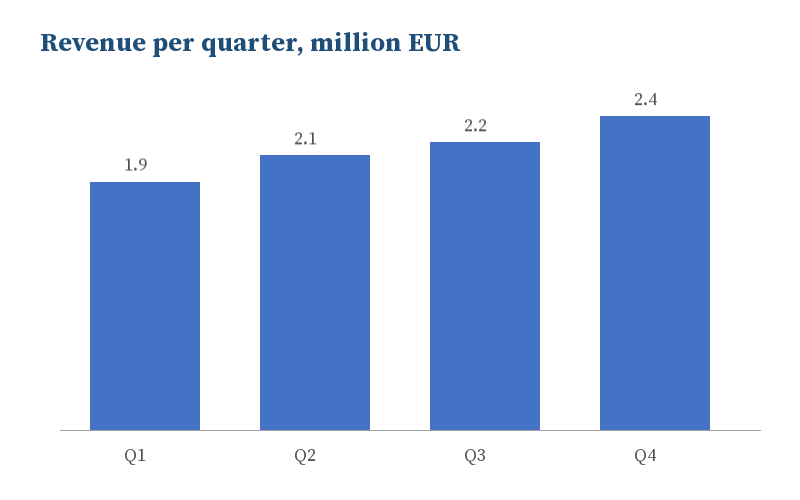

# Team Review, Fourth Quarter
Jonas Example, Sales team

## Highlights
- Revenue up 9 % on the third quarter
- Two new customers
  - Miller & Sons, three years
  - Berg Logistics, one year
- Delivery time down to two days

> Thank the team first, then the numbers.

## Revenue by region
| Region | Q3 | Q4 |
|---|---|---|
| North | 1.2 M | 1.3 M |
| South | 0.9 M | 1.1 M |
> South grew most: the new customers are there.

## Next quarter
- Hire one more person for the warehouse
- Move the invoices to the Invoice Generator (M01)
- Review again in January
